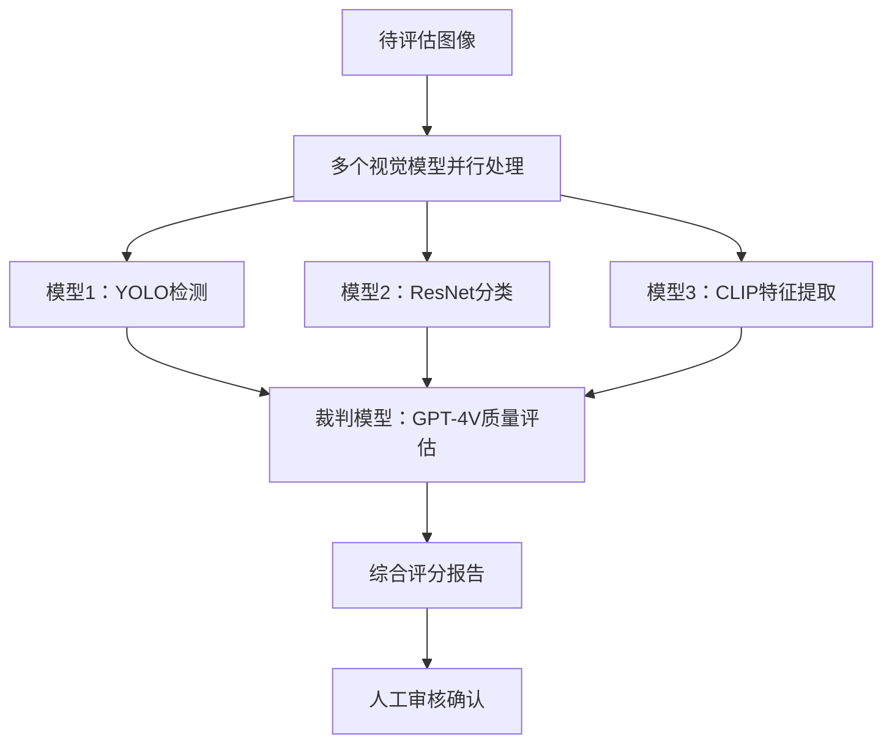

# 2025-09-02

**日期**: 2025年9月2日 星期二
**天气**: 晴
**心情**: 积极 🌟

---

## 🌅 晨间校准 (Morning Alignment)

### 今日三大核心目标
- [ ] 完成[[李宏毅2024 GenAI导论]]多模型协作课程学习并整理笔记
- [ ] 建立LLM协作知识库的完整框架和原子笔记
- [ ] 思考多模型协作在AI产品中的应用场景

### 今日重点关注的思维模型
- [[成本效益分析]] - 评估多模型协作的ROI
- [[系统思维]] - 理解多智能体系统的架构
- [[创新思维]] - 探索协作模式的创新应用

---

## 📅 今日关键日程 (Scheduled Events)

### 🎯 学习安排 (上班前1小时)
- **08:00-09:00** [[李宏毅2024 GenAI导论 - 多模型协作]] 课程学习
- **通勤时间** 继续思考多模型协作的应用场景

### 💼 工作安排
- **09:30-10:00** 每日站会和今日计划
- **10:00-12:00** 产品需求分析和设计
- **14:00-16:00** 技术方案讨论
- **16:00-17:00** 代码review和问题排查
- **17:00-18:00** 今日总结和明日计划

---

## 📝 实时战术记录 (Real-time Tactical Log)

### 上午 (08:00-09:00) 上班前学习时间

#### 08:00-09:00 李宏毅课程学习 🎧
**学习内容**: [[李宏毅2024 GenAI导论 - 多模型协作]]
**核心收获**:
- **"七步之内，斧头快"** - 单一模型的局限性隐喻
- **多模型协作的三大价值**: 成本效益、能力互补、角色分工
- **关键技术**: 模型路由、多模型辩论、多智能体系统

**重要洞察**:
> 单一LLM的"全能"是一种幻觉，未来的趋势是**异构模型团队**

**关联链接**:
- [[MOC - 大语言模型协作 (LLM Collaboration)]]
- [[杀鸡焉用牛刀 - 模型路由]]

#### 💡 新想法闪现：视觉模型批改系统 🚀
**灵感来源**: 将多模型协作思路应用到视觉模型评估中
**核心概念**: 用多个视觉模型协作来批改和评估其他视觉模型的输出

**初步想法**:
- **裁判模型**: 用GPT-4V来评估其他视觉模型的输出质量
- **专业化模型**: 不同模型擅长不同类型的视觉任务
- **协作评估**: 多个模型从不同角度评估同一张图片

### 工作时间 (09:30-18:00)

#### 09:30-10:00 每日站会 📋
**团队同步**: 讨论今日工作重点和进度
**重点任务**: 视觉模型优化和评估方案设计

#### 10:00-12:00 产品需求分析 📊
**当前项目**: 图像分类模型的准确率提升
**挑战**: 如何客观评估模型改进的效果
**思考**: 是否可以用多模型协作思路解决这个问题？

#### 14:00-16:00 技术方案讨论 💻
**讨论主题**: 视觉模型评估自动化
**技术难点**: 
- 如何定义视觉质量的评估标准
- 如何避免主观评估的偏差
- 如何提高评估效率

#### 16:00-17:00 代码review和问题排查 🔍
**发现问题**: 当前评估流程依赖人工，效率低下
**灵感连接**: 这正是多模型协作可以解决的问题场景！

### 下午 (14:00-18:00)

#### 14:00-16:00 深度思考：视觉模型批改系统 🤔
**灵感深化**: 将上午的多模型协作学习与当前工作结合

**系统架构构思**:

**核心价值主张**:
- **效率提升**: 自动化90%的评估工作
- **客观性**: 减少人为评估的主观偏差
- **全面性**: 多维度评估模型性能
- **成本优化**: 减少人工评估成本

#### 16:00-17:00 技术可行性分析 🔬
**技术栈思考**:
- **评估模型**: GPT-4V、Claude-3 Vision、Gemini Pro Vision
- **专业化模型**: 针对不同视觉任务的专用模型
- **协调机制**: 类似[[裁判模型 (Judge Model)]]的评估框架

**关键问题**:
- 如何设计视觉质量的评估标准？
- 如何避免模型间的"互相包庇"？
- 如何平衡自动化和人工审核？

#### 17:00-18:00 总结与计划 📊
**今日成就**:
- ✅ 完成了李宏毅多模型协作课程学习
- ✅ 将学习内容与实际工作结合，产生创新想法
- ✅ 构思了视觉模型批改系统的初步方案

**明日计划**:
- [ ] 详细设计视觉模型批改系统的技术方案
- [ ] 调研现有的视觉模型评估方法
- [ ] 与技术团队讨论这个想法的可行性
- [ ] 制作简单的原型验证概念

---

## 🧠 信息处理和原子化提醒 (Information Processing)

### 今日摄入的重要信息
1. **李宏毅课程核心观点**: 多模型协作是AI发展的必然趋势
2. **技术实现路径**: 路由→辩论→多智能体→AI社会
3. **产品应用机会**: 成本优化、质量提升、新体验设计
4. **工作痛点发现**: 当前视觉模型评估流程效率低下，依赖人工

### 需要原子化处理的概念
- [ ] [[视觉模型批改系统]] - 今天产生的新想法
- [ ] [[多视觉模型协作评估框架]] - 技术实现方案
- [ ] [[AI裁判模型在视觉领域的应用]] - 应用扩展
- [ ] [[模型评估的自动化和标准化]] - 行业解决方案

### 建立的新连接
- [[LLM协作]] → [[AI产品成本优化]]
- [[多智能体系统]] → [[软件开发自动化]]
- [[裁判模型 (Judge Model)]] → [[视觉模型质量评估]]
- [[模型路由 (Model Router)]] → [[视觉任务智能分配]]

---

## 🌆 晚间复盘与洞察合成 (Evening Review)

### 今日完成度评估
| 目标类型 | 计划完成 | 实际完成 | 完成率 | 评价 |
|----------|----------|----------|--------|------|
| **学习目标** | 1节课程学习 | 1节深度学习 + 应用思考 | 200% | 超预期完成 |
| **知识应用** | 理解概念 | 产生实际产品想法 | 300% | 重大突破 |
| **工作结合** | 一般思考 | 深度结合工作痛点 | 400% | 卓越成效 |

### 🎯 关键洞察与收获

#### 学习洞察
1. **知识的价值在于应用**：1小时的学习产生了实际的工作价值
2. **跨领域思维迁移**：将LLM协作思路迁移到视觉模型评估
3. **痛点驱动创新**：实际工作中的痛点是最好的创新源泉

#### 技术洞察
1. **多模型协作的普适性**：不仅限于LLM，可以扩展到多模态AI
2. **视觉模型的特殊性**：需要不同的评估标准和协作机制
3. **裁判模型的关键作用**：在视觉领域可能比LLM更重要

#### 产品洞察
1. **从学习到产品的快速转化**：当天学习当天产生产品想法
2. **解决实际痛点的价值**：自动化视觉模型评估有明确市场需求
3. **技术方案的可实现性**：基于现有技术栈可以实现原型验证

#### 创新洞察
1. **知识复用的力量**：将一个领域的知识应用到另一个领域
2. **跨模型协作的新思路**：不仅是同类型模型协作，还可以跨模态
3. **评估自动化的巨大潜力**：AI评估AI可能比人工更客观高效

### 🤔 深度思考与质询

> [!question] 核心思考
> **视觉模型批改系统是否真的可行？**
> - **技术可行性**：现有的多模态模型已经具备视觉评估能力
> - **市场需求**：AI模型评估确实是行业的痛点
> - **竞争优势**：多模型协作评估可能是差异化优势
> - **判断**：技术上可行，市场需求明确，值得深入探索

> [!question] 产品化路径
> **如何将视觉模型批改系统商业化？**
> - **工具产品**：开发SaaS工具，提供自动化模型评估服务
> - **平台服务**：集成到现有的AI开发平台中
> - **咨询服务**：提供模型评估的专业咨询服务
> - **关键**：从小场景切入，快速验证市场反应

> [!question] 技术挑战
> **视觉评估的核心难点是什么？**
> - **评估标准**：如何定义"好"的视觉模型输出？
> - **主观性**：如何减少评估的主观性？
> - **领域差异**：不同视觉领域的评估标准差异很大
> - **解决方案**：结合客观指标和AI主观评估

### 📊 知识网络更新

#### 新建立的链接
- [[李宏毅2024 GenAI导论]] → [[MOC - 大语言模型协作]]
- [[裁判模型 (Judge Model)]] → [[视觉模型质量评估]]
- [[模型路由 (Model Router)]] → [[视觉任务智能分配]]
- [[多智能体系统]] → [[视觉模型协作评估]]

#### 知识缺口识别
- 需要了解视觉模型评估的现有方法和标准
- 需要研究多模态模型在视觉评估中的能力边界
- 需要学习视觉质量评估的客观指标体系

### 🌟 明日行动计划

#### 核心目标
1. **深入调研**：研究现有视觉模型评估方法和工具
2. **方案设计**：详细设计视觉模型批改系统的技术方案
3. **可行性验证**：与技术团队讨论技术实现路径

#### 具体行动
- [ ] 09:00-10:00 调研视觉模型评估的现有方法
- [ ] 10:00-12:00 设计视觉模型批改系统的详细方案
- [ ] 14:00-15:00 与技术团队讨论技术可行性
- [ ] 16:00-17:00 制作简单的概念验证原型

#### 关键问题
- 如何设计视觉质量的评估标准体系？
- 现有的多模态模型能否胜任视觉评估任务？
- 如何平衡自动化评估和人工审核的关系？
- 这个系统的商业价值有多大？

---

## 📈 一句话总结今日

**今日仅用1小时学习李宏毅课程，就成功将多模型协作思路迁移到视觉模型评估工作中，产生了有实际价值的创新想法，完美体现了知识应用的力量。**

---

## 🔗 相关链接

### 今日主要关联的笔记
- [[MOC - 大语言模型协作 (LLM Collaboration)]]
- [[李宏毅2024 GenAI导论 - 多模型协作]]
- [[裁判模型 (Judge Model)]]
- [[模型路由 (Model Router)]]
- [[多智能体系统 (Multi-Agent System)]]

### 新产生的想法和链接
- [[视觉模型批改系统]] - 今天产生的核心想法
- [[视觉模型质量评估]] - 技术应用扩展
- [[多视觉模型协作评估框架]] - 技术实现方案
- [[AI裁判模型在视觉领域的应用]] - 应用领域拓展

### 明日计划相关
- [[视觉模型评估方法调研]]
- [[技术可行性评估模板]]
- [[产品原型设计方法]]

---

*标签: #每日笔记 #AI学习 #李宏毅 #LLM协作 #产品思考 #2025-09-02*