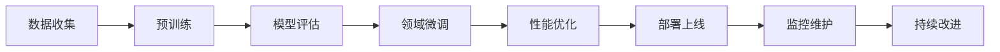

# LLM完整生命周期

> [!info] **三大核心环节**：预训练、微调、推理的完整流程

## 🔄 生命周期概览



## 🏗️ 第一阶段：预训练

### 数据准备
```markdown
# 数据收集与处理
- **数据来源**: 网页、书籍、论文、代码等
- **数据清洗**: 去重、去噪、格式标准化
- **质量控制**: 内容审核、事实核查
- **数据量**: 通常需要TB级别数据
```

### 预训练过程
```python
# 预训练伪代码
def pretrain_model(model, dataset, config):
    optimizer = AdamW(model.parameters(), lr=config.learning_rate)
    
    for epoch in range(config.num_epochs):
        for batch in dataloader:
            # 前向传播
            outputs = model(batch.input_ids, batch.attention_mask)
            loss = outputs.loss
            
            # 反向传播
            loss.backward()
            optimizer.step()
            optimizer.zero_grad()
            
            # 记录指标
            log_metrics(loss, learning_rate)
```

### 预训练关键技术
- **分布式训练**: 多GPU/TPU并行
- **混合精度**: FP16/BF16加速
- **梯度累积**: 处理大批量数据
- **学习率调度**: Warm-up + Decay

## 🎯 第二阶段：微调

### 微调策略分类
| 策略类型 | 特点 | 适用场景 | 成本 |
|----------|------|----------|------|
| 全参数微调 | 更新所有参数 | 领域适配要求高 | 高 |
| LoRA | 低秩分解 | 参数高效 | 中 |
| P-Tuning | 提示微调 | 快速适配 | 低 |
| Adapter | 适配器插入 | 多任务 | 中 |

### LoRA微调详解
```python
# LoRA实现示例
class LoRALayer(nn.Module):
    def __init__(self, original_layer, rank=8, alpha=16):
        super().__init__()
        self.original_layer = original_layer
        
        # LoRA参数
        self.rank = rank
        self.alpha = alpha
        
        # 低秩矩阵
        in_features = original_layer.in_features
        out_features = original_layer.out_features
        
        self.A = nn.Parameter(torch.randn(in_features, rank))
        self.B = nn.Parameter(torch.randn(rank, out_features))
        
    def forward(self, x):
        # 原始权重 + LoRA增量
        original_output = self.original_layer(x)
        lora_output = (x @ self.A @ self.B) * (self.alpha / self.rank)
        return original_output + lora_output
```

### 微调最佳实践
```markdown
# 微调关键要素
- **数据质量**: 高质量的领域数据
- **学习率**: 通常比预训练小10-100倍
- **训练轮数**: 避免过拟合
- **验证集**: 定期评估模型性能
```

## 🚀 第三阶段：推理部署

### 推理优化技术
```python
# 推理优化技术栈
class OptimizedModel:
    def __init__(self, model):
        self.model = model
        
        # 1. 量化
        self.model = quantize_model(model, bits=8)
        
        # 2. 蒸馏
        self.model = distill_model(model, teacher_model)
        
        # 3. 剪枝
        self.model = prune_model(model, sparsity=0.5)
        
        # 4. 编译优化
        self.model = compile_model(model)
    
    def inference(self, input_data):
        # 流式推理
        return self.model.generate(input_data, stream=True)
```

### 部署架构
```markdown
# 部署架构设计
- **边缘部署**: 移动端、IoT设备
- **云端部署**: GPU/TPU集群
- **混合部署**: 边缘+云端协同
- **服务化**: RESTful API、gRPC
```

### 监控与维护
```python
# 模型监控系统
class ModelMonitor:
    def __init__(self, model_name):
        self.model_name = model_name
        self.metrics_collector = MetricsCollector()
        
    def monitor_performance(self):
        # 性能指标
        metrics = {
            'latency': self.measure_latency(),
            'throughput': self.measure_throughput(),
            'error_rate': self.measure_error_rate(),
            'resource_usage': self.measure_resource_usage()
        }
        
        # 告警机制
        self.check_alerts(metrics)
        
    def detect_drift(self):
        # 检测模型性能漂移
        current_performance = self.evaluate_model()
        baseline_performance = self.load_baseline()
        
        if self.detect_significant_drift(current_performance, baseline_performance):
            self.trigger_retraining()
```

## 📊 生命周期各阶段成本分析

### 成本构成
```markdown
# 成本分析
## 预训练阶段
- **计算成本**: 数百万到数千万美元
- **时间成本**: 数周到数月
- **人力成本**: 研究团队成本

## 微调阶段
- **计算成本**: 数千到数万美元
- **时间成本**: 数天到数周
- **数据成本**: 数据标注和处理

## 推理阶段
- **计算成本**: 按使用量计费
- **维护成本**: 监控和更新
- **扩展成本**: 用户增长
```

### ROI评估框架
```python
def calculate_llm_roi(project):
    # 成本计算
    pretraining_cost = project.pretraining.compute_cost + project.pretraining.time_cost
    finetuning_cost = project.finetuning.compute_cost + project.finetuning.data_cost
    inference_cost = project.inference.monthly_cost * 12
    
    total_cost = pretraining_cost + finetuning_cost + inference_cost
    
    # 收益计算
    revenue_increase = project.business_metrics.revenue_increase
    cost_savings = project.business_metrics.cost_savings
    efficiency_gain = project.business_metrics.efficiency_gain
    
    total_benefit = revenue_increase + cost_savings + efficiency_gain
    
    # ROI计算
    roi = (total_benefit - total_cost) / total_cost
    
    return {
        'roi': roi,
        'payback_period': total_cost / (total_benefit / 12),
        'total_cost': total_cost,
        'total_benefit': total_benefit
    }
```

## 🎯 产品经理关注点

### 项目规划
```markdown
# 产品规划要点
- **技术选型**: 根据业务需求选择合适的技术路线
- **预算规划**: 合理分配各阶段预算
- **时间规划**: 制定合理的时间表
- **风险评估**: 识别潜在风险和应对策略
```

### 用户体验
- **响应时间**: 推理延迟控制
- **准确性**: 模型输出质量
- **稳定性**: 服务可用性
- **成本透明**: 清晰的定价策略

### 商业模式
- **SaaS订阅**: 月度/年度订阅
- **按使用量计费**: API调用计费
- **企业定制**: 定制化解决方案
- **混合模式**: 多种收费方式结合

## 🔗 相关概念

- [[什么是Token]] - 预训练和推理的基本单位
- [[Token知识 - AI产品经理版]] - 成本和用户体验考虑
- [[大模型关键技术栈]] - 预训练和微调的技术细节
- [[模型推理优化]] - 推理阶段的性能优化

## 📝 最佳实践总结

### 技术最佳实践
```markdown
# 技术实践清单
- ✅ 数据质量优先
- ✅ 合理的模型规模
- ✅ 持续的性能监控
- ✅ 自动化CI/CD流程
- ✅ 安全和隐私保护
```

### 产品最佳实践
```markdown
# 产品实践清单
- ✅ 用户需求驱动
- ✅ 渐进式功能发布
- ✅ 持续的用户反馈
- ✅ 数据驱动的决策
- ✅ 清晰的价值主张
```

---

*标签：#LLM生命周期 #预训练 #微调 #推理部署 #AI产品经理*
*相关项目：[[AI产品经理技术栈项目]]*
*学习状态：#技术原理 🟡 #应用实践 🟡*