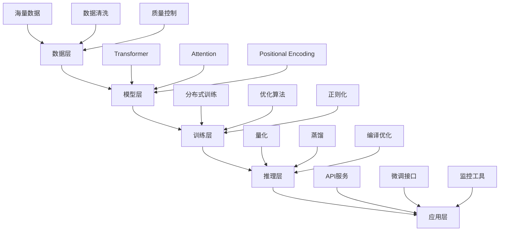

# 大模型关键技术栈

> [!info] **技术支柱**：支撑大语言模型的核心技术组件

## 🏗️ 技术栈整体架构



## 🧠 核心技术组件

### 1. Transformer架构
```python
# Transformer核心组件
class Transformer(nn.Module):
    def __init__(self, d_model=512, nhead=8, num_layers=6):
        super().__init__()
        self.d_model = d_model
        self.nhead = nhead
        self.num_layers = num_layers
        
        # 编码器
        self.encoder = nn.TransformerEncoder(
            nn.TransformerEncoderLayer(
                d_model=d_model,
                nhead=nhead,
                dim_feedforward=2048,
                dropout=0.1
            ),
            num_layers=num_layers
        )
        
        # 解码器
        self.decoder = nn.TransformerDecoder(
            nn.TransformerDecoderLayer(
                d_model=d_model,
                nhead=nhead,
                dim_feedforward=2048,
                dropout=0.1
            ),
            num_layers=num_layers
        )
```

### 2. Attention机制
```python
# Multi-Head Attention实现
class MultiHeadAttention(nn.Module):
    def __init__(self, d_model, n_head):
        super().__init__()
        self.d_model = d_model
        self.n_head = n_head
        self.d_k = d_model // n_head
        
        # 线性变换
        self.w_q = nn.Linear(d_model, d_model)
        self.w_k = nn.Linear(d_model, d_model)
        self.w_v = nn.Linear(d_model, d_model)
        self.w_o = nn.Linear(d_model, d_model)
        
    def forward(self, query, key, value, mask=None):
        batch_size = query.size(0)
        
        # 线性变换
        Q = self.w_q(query).view(batch_size, -1, self.n_head, self.d_k).transpose(1, 2)
        K = self.w_k(key).view(batch_size, -1, self.n_head, self.d_k).transpose(1, 2)
        V = self.w_v(value).view(batch_size, -1, self.n_head, self.d_k).transpose(1, 2)
        
        # 计算注意力分数
        scores = torch.matmul(Q, K.transpose(-2, -1)) / math.sqrt(self.d_k)
        
        # 应用mask
        if mask is not None:
            scores = scores.masked_fill(mask == 0, -1e9)
        
        # Softmax
        attn_weights = F.softmax(scores, dim=-1)
        
        # 加权求和
        context = torch.matmul(attn_weights, V)
        
        # 输出变换
        output = context.transpose(1, 2).contiguous().view(batch_size, -1, self.d_model)
        output = self.w_o(output)
        
        return output, attn_weights
```

### 3. Positional Encoding
```python
# 位置编码实现
class PositionalEncoding(nn.Module):
    def __init__(self, d_model, max_len=5000):
        super().__init__()
        
        pe = torch.zeros(max_len, d_model)
        position = torch.arange(0, max_len, dtype=torch.float).unsqueeze(1)
        div_term = torch.exp(torch.arange(0, d_model, 2).float() * 
                           (-math.log(10000.0) / d_model))
        
        pe[:, 0::2] = torch.sin(position * div_term)
        pe[:, 1::2] = torch.cos(position * div_term)
        pe = pe.unsqueeze(0).transpose(0, 1)
        
        self.register_buffer('pe', pe)
    
    def forward(self, x):
        return x + self.pe[:x.size(0), :]
```

## 📊 预训练策略

### 1. 自监督学习
```markdown
# 预训练目标函数
- **MLM (Masked Language Modeling)**: 随机mask部分token，预测被mask的内容
- **NSP (Next Sentence Prediction)**: 判断两个句子是否连续
- **CLM (Causal Language Modeling)**: 自回归生成下一个token
```

### 2. 预训练配置
```python
# 预训练配置示例
PRETRAINING_CONFIG = {
    # 模型配置
    'model_type': 'transformer',
    'hidden_size': 768,
    'num_hidden_layers': 12,
    'num_attention_heads': 12,
    'intermediate_size': 3072,
    
    # 训练配置
    'max_position_embeddings': 512,
    'max_seq_length': 512,
    'batch_size': 32,
    'learning_rate': 5e-5,
    'num_epochs': 10,
    
    # 优化器配置
    'optimizer': 'adamw',
    'weight_decay': 0.01,
    'adam_beta1': 0.9,
    'adam_beta2': 0.999,
    
    # 学习率调度
    'lr_scheduler': 'cosine',
    'warmup_steps': 1000,
    
    # 正则化
    'dropout': 0.1,
    'layer_norm_eps': 1e-12
}
```

## 🚀 规模化方法

### 1. 分布式训练
```python
# 分布式训练策略
class DistributedTrainer:
    def __init__(self, model, config):
        self.model = model
        self.config = config
        
        # 初始化分布式环境
        dist.init_process_group(backend='nccl')
        
        # 数据并行
        self.model = nn.parallel.DistributedDataParallel(
            model,
            device_ids=[local_rank],
            output_device=local_rank
        )
        
    def train_step(self, batch):
        # 前向传播
        outputs = self.model(batch)
        loss = outputs.loss
        
        # 反向传播
        loss.backward()
        
        # 梯度同步
        self.model.reduce_gradients()
        
        # 参数更新
        self.optimizer.step()
        self.optimizer.zero_grad()
        
        return loss.item()
```

### 2. 混合精度训练
```python
# 混合精度训练
class MixedPrecisionTrainer:
    def __init__(self, model):
        self.model = model
        self.scaler = torch.cuda.amp.GradScaler()
        
    def train_step(self, batch):
        with torch.cuda.amp.autocast():
            outputs = self.model(batch)
            loss = outputs.loss
        
        self.scaler.scale(loss).backward()
        self.scaler.step(self.optimizer)
        self.scaler.update()
        self.optimizer.zero_grad()
        
        return loss.item()
```

## 🔧 模型优化技术

### 1. 量化技术
```python
# 模型量化
def quantize_model(model, bits=8):
    # 动态量化
    quantized_model = torch.quantization.quantize_dynamic(
        model,
        {torch.nn.Linear},
        dtype=torch.qint8
    )
    return quantized_model
```

### 2. 知识蒸馏
```python
# 知识蒸馏
class DistillationLoss(nn.Module):
    def __init__(self, temperature=4.0, alpha=0.3):
        super().__init__()
        self.temperature = temperature
        self.alpha = alpha
        self.kl_div = nn.KLDivLoss(reduction='batchmean')
        
    def forward(self, student_logits, teacher_logits, true_labels):
        # 学生模型与真实标签的损失
        hard_loss = F.cross_entropy(student_logits, true_labels)
        
        # 学生与教师模型的KL散度
        soft_loss = self.kl_div(
            F.log_softmax(student_logits / self.temperature, dim=1),
            F.softmax(teacher_logits / self.temperature, dim=1)
        ) * (self.temperature ** 2)
        
        return self.alpha * soft_loss + (1 - self.alpha) * hard_loss
```

## 📈 性能评估指标

### 模型性能指标
```markdown
# 基础指标
- **Perplexity**: 语言模型困惑度
- **Accuracy**: 分类准确率
- **F1-Score**: 精确率和召回率的调和平均
- **BLEU/ROUGE**: 文本生成质量

# 效率指标
- **Parameters**: 模型参数数量
- **FLOPs**: 计算复杂度
- **Latency**: 推理延迟
- **Throughput**: 吞吐量
```

### 评估框架
```python
class ModelEvaluator:
    def __init__(self, model, tokenizer):
        self.model = model
        self.tokenizer = tokenizer
        
    def evaluate_perplexity(self, test_dataset):
        total_loss = 0
        total_tokens = 0
        
        with torch.no_grad():
            for batch in test_dataset:
                outputs = self.model(**batch)
                loss = outputs.loss
                total_loss += loss.item() * batch['input_ids'].size(1)
                total_tokens += batch['input_ids'].size(1)
        
        perplexity = math.exp(total_loss / total_tokens)
        return perplexity
    
    def evaluate_generation_quality(self, prompts, references):
        # 生成文本
        generated_texts = []
        for prompt in prompts:
            inputs = self.tokenizer(prompt, return_tensors="pt")
            outputs = self.model.generate(**inputs, max_length=100)
            generated = self.tokenizer.decode(outputs[0], skip_special_tokens=True)
            generated_texts.append(generated)
        
        # 计算BLEU分数
        bleu_scores = []
        for gen, ref in zip(generated_texts, references):
            score = calculate_bleu(gen, ref)
            bleu_scores.append(score)
        
        return np.mean(bleu_scores)
```

## 🎯 产品经理关注点

### 技术选型决策
```markdown
# 技术选型框架
## 模型规模选择
- **小型模型** (<1B参数): 移动端、实时应用
- **中型模型** (1-10B参数): 企业应用、API服务
- **大型模型** (>10B参数): 复杂任务、研究应用

## 架构选择
- **Encoder-Decoder**: 生成任务、翻译
- **Decoder-only**: 通用对话、续写
- **Encoder-only**: 分类、理解任务
```

### 成本效益分析
```python
def calculate_tech_stack_cost(config):
    # 计算成本
    costs = {
        'pretraining_cost': config.model_size * config.data_size * 0.000001,  # 简化计算
        'inference_cost': config.model_size * config.daily_requests * 0.0000001,
        'maintenance_cost': config.model_size * 0.1,  # 年维护成本
    }
    
    # 效益评估
    benefits = {
        'accuracy_improvement': config.baseline_accuracy - config.target_accuracy,
        'latency_reduction': config.baseline_latency - config.target_latency,
        'user_satisfaction': config.satisfaction_score,
    }
    
    return {
        'total_cost': sum(costs.values()),
        'total_benefit': sum(benefits.values()),
        'roi': (sum(benefits.values()) - sum(costs.values())) / sum(costs.values())
    }
```

### 风险管理
```markdown
# 技术风险评估
- **技术风险**: 新技术不成熟、性能不达预期
- **成本风险**: 预算超支、ROI不达预期
- **时间风险**: 开发延期、错过市场窗口
- **合规风险**: 数据隐私、监管要求

# 风险应对策略
- **技术验证**: 小规模POC验证
- **渐进式投入**: 分阶段投入资源
- **备选方案**: 准备技术备选方案
- **持续监控**: 定期评估技术风险
```

## 🔗 相关概念

- [[Transformer架构解析]] - Transformer的详细解析
- [[训练推理原理]] - 训练和推理的深度原理
- [[模型推理优化]] - 推理阶段的优化技术
- [[LoRA微调技术]] - 参数高效的微调方法

## 📝 实践建议

### 技术实施建议
```markdown
# 实施建议
1. **从小开始**: 先用小模型验证概念
2. **逐步扩展**: 根据需求逐步扩大规模
3. **持续优化**: 持续监控和优化性能
4. **团队协作**: 建立跨职能团队
```

### 产品建议
```markdown
# 产品建议
1. **用户导向**: 以用户需求为核心
2. **价值驱动**: 专注于创造实际价值
3. **快速迭代**: 敏捷开发和快速迭代
4. **数据驱动**: 基于数据做决策
```

---

*标签：#大模型 #技术栈 #Transformer #AI产品经理*
*相关项目：[[AI产品经理技术栈项目]]*
*学习状态：#技术原理 🟡 #应用实践 🟡*