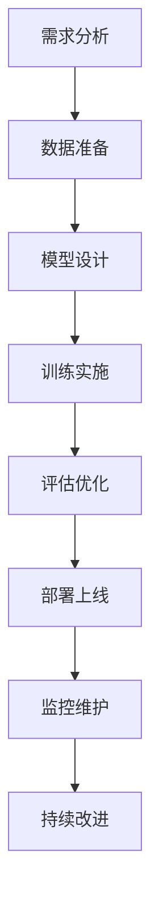

# 模型开发全流程

> [!info] **从训练到部署**：完整的大模型开发流程管理

## 🔄 开发流程概览



## 📋 需求分析阶段

### 业务需求调研
```markdown
# 需求分析框架
## 业务目标
- **核心价值**: 解决什么业务问题
- **用户群体**: 目标用户画像
- **使用场景**: 具体应用场景
- **成功指标**: 如何衡量成功

## 技术需求
- **性能要求**: 准确率、延迟、吞吐量
- **功能要求**: 模型能力边界
- **安全要求**: 数据隐私、内容安全
- **成本要求**: 训练成本、推理成本
```

### 技术可行性评估
```python
def technical_feasibility_assessment(requirements):
    """
    技术可行性评估
    """
    assessment = {
        'data_availability': evaluate_data_availability(requirements),
        'model_suitability': evaluate_model_suitability(requirements),
        'computational_resources': evaluate_resources(requirements),
        'timeline_feasibility': evaluate_timeline(requirements),
        'risk_assessment': evaluate_risks(requirements)
    }
    
    return assessment

def evaluate_model_suitability(requirements):
    """
    模型适用性评估
    """
    model_options = {
        'small_model': {
            'parameters': '1B-7B',
            'accuracy': 'medium',
            'cost': 'low',
            'latency': 'low',
            'suitable_for': ['simple_tasks', 'edge_deployment']
        },
        'medium_model': {
            'parameters': '7B-70B',
            'accuracy': 'high',
            'cost': 'medium',
            'latency': 'medium',
            'suitable_for': ['complex_tasks', 'cloud_deployment']
        },
        'large_model': {
            'parameters': '70B+',
            'accuracy': 'very_high',
            'cost': 'high',
            'latency': 'high',
            'suitable_for': ['research', 'cutting_edge_tasks']
        }
    }
    
    # 根据需求推荐模型
    return recommend_model(requirements, model_options)
```

## 🗃️ 数据准备阶段

### 数据收集与清洗
```python
class DataPipeline:
    def __init__(self, config):
        self.config = config
        self.data_sources = config.data_sources
        self.quality_thresholds = config.quality_thresholds
        
    def collect_data(self):
        """
        数据收集
        """
        collected_data = {}
        
        for source in self.data_sources:
            try:
                data = self.fetch_from_source(source)
                collected_data[source] = data
                logger.info(f"Collected {len(data)} samples from {source}")
            except Exception as e:
                logger.error(f"Failed to collect data from {source}: {e}")
                
        return collected_data
    
    def clean_data(self, raw_data):
        """
        数据清洗
        """
        cleaned_data = []
        
        for item in raw_data:
            # 基础清洗
            cleaned_item = self.basic_cleaning(item)
            
            # 质量检查
            if self.pass_quality_check(cleaned_item):
                cleaned_data.append(cleaned_item)
                
        return cleaned_data
    
    def basic_cleaning(self, item):
        """
        基础数据清洗
        """
        # 去除HTML标签
        item = self.remove_html_tags(item)
        
        # 去除特殊字符
        item = self.remove_special_chars(item)
        
        # 标准化格式
        item = self.normalize_format(item)
        
        # 去重
        item = self.remove_duplicates(item)
        
        return item
    
    def pass_quality_check(self, item):
        """
        质量检查
        """
        # 长度检查
        if not self.config.min_length <= len(item) <= self.config.max_length:
            return False
            
        # 内容质量检查
        if self.detect_low_quality_content(item):
            return False
            
        # 语言检查
        if not self.detect_language(item):
            return False
            
        return True
```

### 数据增强与预处理
```python
class DataAugmentation:
    def __init__(self, augmentation_config):
        self.config = augmentation_config
        
    def augment_text_data(self, text_data):
        """
        文本数据增强
        """
        augmented_data = []
        
        for text in text_data:
            # 原始文本
            augmented_data.append(text)
            
            # 同义词替换
            if self.config.synonym_replacement:
                augmented_data.append(self.synonym_replace(text))
                
            # 随机插入
            if self.config.random_insertion:
                augmented_data.append(self.random_insert(text))
                
            # 随机删除
            if self.config.random_deletion:
                augmented_data.append(self.random_delete(text))
                
            # 随机交换
            if self.config.random_swap:
                augmented_data.append(self.random_swap(text))
                
        return augmented_data
    
    def create_training_dataset(self, raw_data, tokenizer, max_length=512):
        """
        创建训练数据集
        """
        dataset = []
        
        for item in raw_data:
            # Tokenization
            tokens = tokenizer(
                item['text'],
                max_length=max_length,
                padding='max_length',
                truncation=True,
                return_tensors='pt'
            )
            
            # 创建标签
            labels = self.create_labels(item)
            
            dataset.append({
                'input_ids': tokens['input_ids'],
                'attention_mask': tokens['attention_mask'],
                'labels': labels
            })
            
        return dataset
```

## 🏗️ 模型设计阶段

### 模型架构选择
```python
class ModelArchitectureSelector:
    def __init__(self):
        self.architectures = {
            'encoder_only': {
                'models': ['BERT', 'RoBERTa', 'DistilBERT'],
                'suitable_for': ['classification', 'ner', 'qa'],
                'strengths': ['understanding', 'representation'],
                'weaknesses': ['generation']
            },
            'decoder_only': {
                'models': ['GPT', 'LLaMA', 'Falcon'],
                'suitable_for': ['generation', 'dialogue', 'writing'],
                'strengths': ['generation', 'coherence'],
                'weaknesses': ['understanding']
            },
            'encoder_decoder': {
                'models': ['T5', 'BART', 'Pegasus'],
                'suitable_for': ['translation', 'summarization', 'seq2seq'],
                'strengths': ['both_understanding_and_generation'],
                'weaknesses': ['complexity']
            }
        }
    
    def select_architecture(self, task_requirements):
        """
        选择模型架构
        """
        task_type = task_requirements['task_type']
        performance_requirements = task_requirements['performance']
        resource_constraints = task_requirements['resources']
        
        # 根据任务类型筛选
        suitable_architectures = self.filter_by_task_type(task_type)
        
        # 根据性能要求筛选
        suitable_architectures = self.filter_by_performance(
            suitable_architectures, performance_requirements
        )
        
        # 根据资源约束筛选
        suitable_architectures = self.filter_by_resources(
            suitable_architectures, resource_constraints
        )
        
        return suitable_architectures
```

### 模型配置设计
```python
class ModelConfig:
    def __init__(self, base_model, task_config):
        self.base_model = base_model
        self.task_config = task_config
        
    def create_config(self):
        """
        创建模型配置
        """
        config = {
            # 基础配置
            'model_name': self.base_model,
            'model_type': self.get_model_type(),
            
            # 架构配置
            'hidden_size': self.task_config.get('hidden_size', 768),
            'num_hidden_layers': self.task_config.get('num_layers', 12),
            'num_attention_heads': self.task_config.get('num_heads', 12),
            'intermediate_size': self.task_config.get('intermediate_size', 3072),
            
            # 训练配置
            'max_position_embeddings': self.task_config.get('max_length', 512),
            'vocab_size': self.task_config.get('vocab_size', 50000),
            'hidden_act': 'gelu',
            'hidden_dropout_prob': 0.1,
            'attention_probs_dropout_prob': 0.1,
            
            # 任务特定配置
            'task_type': self.task_config['task_type'],
            'num_labels': self.task_config.get('num_labels', 2),
            
            # 优化配置
            'learning_rate': self.task_config.get('learning_rate', 2e-5),
            'weight_decay': self.task_config.get('weight_decay', 0.01),
            'warmup_steps': self.task_config.get('warmup_steps', 1000),
        }
        
        return config
```

## 🚀 训练实施阶段

### 训练环境配置
```python
class TrainingEnvironment:
    def __init__(self, config):
        self.config = config
        self.device = self.setup_device()
        self.distributed = self.setup_distributed()
        
    def setup_device(self):
        """
        设置训练设备
        """
        if torch.cuda.is_available():
            device = torch.device('cuda')
            gpu_count = torch.cuda.device_count()
            logger.info(f"Using {gpu_count} GPUs")
        else:
            device = torch.device('cpu')
            logger.info("Using CPU")
            
        return device
    
    def setup_distributed(self):
        """
        设置分布式训练
        """
        if self.config.distributed_training:
            torch.distributed.init_process_group(backend='nccl')
            local_rank = int(os.environ.get('LOCAL_RANK', 0))
            torch.cuda.set_device(local_rank)
            return True
        return False
    
    def create_dataloader(self, dataset, batch_size, shuffle=True):
        """
        创建数据加载器
        """
        if self.distributed:
            sampler = torch.utils.data.distributed.DistributedSampler(dataset)
        else:
            sampler = None
            
        dataloader = torch.utils.data.DataLoader(
            dataset,
            batch_size=batch_size,
            shuffle=shuffle and (sampler is None),
            sampler=sampler,
            num_workers=self.config.num_workers,
            pin_memory=True
        )
        
        return dataloader
```

### 训练循环实现
```python
class Trainer:
    def __init__(self, model, config):
        self.model = model
        self.config = config
        self.optimizer = self.setup_optimizer()
        self.scheduler = self.setup_scheduler()
        self.criterion = self.setup_criterion()
        
    def setup_optimizer(self):
        """
        设置优化器
        """
        if self.config.optimizer == 'adamw':
            optimizer = torch.optim.AdamW(
                self.model.parameters(),
                lr=self.config.learning_rate,
                weight_decay=self.config.weight_decay,
                betas=(0.9, 0.999),
                eps=1e-8
            )
        elif self.config.optimizer == 'sgd':
            optimizer = torch.optim.SGD(
                self.model.parameters(),
                lr=self.config.learning_rate,
                momentum=0.9
            )
        else:
            raise ValueError(f"Unknown optimizer: {self.config.optimizer}")
            
        return optimizer
    
    def setup_scheduler(self):
        """
        设置学习率调度器
        """
        if self.config.scheduler == 'cosine':
            scheduler = torch.optim.lr_scheduler.CosineAnnealingLR(
                self.optimizer,
                T_max=self.config.num_epochs,
                eta_min=self.config.min_lr
            )
        elif self.config.scheduler == 'linear':
            scheduler = torch.optim.lr_scheduler.LinearLR(
                self.optimizer,
                start_factor=1.0,
                end_factor=0.1,
                total_iters=self.config.num_epochs
            )
        else:
            scheduler = None
            
        return scheduler
    
    def train_epoch(self, dataloader, epoch):
        """
        训练一个epoch
        """
        self.model.train()
        total_loss = 0
        num_batches = len(dataloader)
        
        progress_bar = tqdm(dataloader, desc=f'Epoch {epoch}')
        
        for batch_idx, batch in enumerate(progress_bar):
            # 数据移到设备
            batch = self.move_to_device(batch)
            
            # 前向传播
            outputs = self.model(**batch)
            loss = outputs.loss
            
            # 反向传播
            loss.backward()
            
            # 梯度裁剪
            if self.config.max_grad_norm > 0:
                torch.nn.utils.clip_grad_norm_(
                    self.model.parameters(),
                    self.config.max_grad_norm
                )
            
            # 参数更新
            self.optimizer.step()
            self.optimizer.zero_grad()
            
            # 学习率调度
            if self.scheduler:
                self.scheduler.step()
            
            # 记录损失
            total_loss += loss.item()
            
            # 更新进度条
            progress_bar.set_postfix({
                'loss': loss.item(),
                'lr': self.optimizer.param_groups[0]['lr']
            })
        
        avg_loss = total_loss / num_batches
        return avg_loss
```

## 📊 评估优化阶段

### 模型评估
```python
class ModelEvaluator:
    def __init__(self, model, tokenizer, config):
        self.model = model
        self.tokenizer = tokenizer
        self.config = config
        
    def evaluate(self, dataloader):
        """
        评估模型性能
        """
        self.model.eval()
        total_loss = 0
        predictions = []
        references = []
        
        with torch.no_grad():
            for batch in tqdm(dataloader, desc='Evaluating'):
                batch = self.move_to_device(batch)
                
                outputs = self.model(**batch)
                loss = outputs.loss
                
                total_loss += loss.item()
                
                # 收集预测结果
                if 'labels' in batch:
                    preds = torch.argmax(outputs.logits, dim=-1)
                    predictions.extend(preds.cpu().numpy())
                    references.extend(batch['labels'].cpu().numpy())
        
        # 计算指标
        metrics = self.calculate_metrics(predictions, references)
        metrics['eval_loss'] = total_loss / len(dataloader)
        
        return metrics
    
    def calculate_metrics(self, predictions, references):
        """
        计算评估指标
        """
        metrics = {}
        
        # 准确率
        accuracy = accuracy_score(references, predictions)
        metrics['accuracy'] = accuracy
        
        # F1分数
        f1 = f1_score(references, predictions, average='weighted')
        metrics['f1'] = f1
        
        # 精确率和召回率
        precision = precision_score(references, predictions, average='weighted')
        recall = recall_score(references, predictions, average='weighted')
        metrics['precision'] = precision
        metrics['recall'] = recall
        
        return metrics
```

### 模型优化
```python
class ModelOptimizer:
    def __init__(self, model, config):
        self.model = model
        self.config = config
        
    def optimize_model(self):
        """
        模型优化
        """
        # 量化
        if self.config.quantization:
            self.model = self.quantize_model()
        
        # 蒸馏
        if self.config.distillation:
            self.model = self.distill_model()
        
        # 剪枝
        if self.config.pruning:
            self.model = self.prune_model()
        
        return self.model
    
    def quantize_model(self):
        """
        模型量化
        """
        if self.config.quantization_bits == 8:
            quantized_model = torch.quantization.quantize_dynamic(
                self.model,
                {torch.nn.Linear},
                dtype=torch.qint8
            )
        elif self.config.quantization_bits == 16:
            quantized_model = self.model.half()
        
        return quantized_model
```

## 🚀 部署上线阶段

### 模型部署
```python
class ModelDeployer:
    def __init__(self, model, config):
        self.model = model
        self.config = config
        
    def deploy_model(self):
        """
        部署模型
        """
        # 保存模型
        self.save_model()
        
        # 创建API服务
        if self.config.deployment_type == 'api':
            self.create_api_service()
        
        # 创建Web应用
        elif self.config.deployment_type == 'web':
            self.create_web_application()
        
        # 创建移动应用
        elif self.config.deployment_type == 'mobile':
            self.create_mobile_application()
    
    def create_api_service(self):
        """
        创建API服务
        """
        from fastapi import FastAPI
        from pydantic import BaseModel
        
        app = FastAPI()
        
        class PredictionRequest(BaseModel):
            text: str
            
        class PredictionResponse(BaseModel):
            prediction: str
            confidence: float
        
        @app.post("/predict")
        async def predict(request: PredictionRequest):
            result = self.model.predict(request.text)
            return PredictionResponse(
                prediction=result['prediction'],
                confidence=result['confidence']
            )
        
        return app
```

## 📈 监控维护阶段

### 性能监控
```python
class ModelMonitor:
    def __init__(self, model, config):
        self.model = model
        self.config = config
        self.metrics_collector = MetricsCollector()
        
    def monitor_performance(self):
        """
        监控模型性能
        """
        # 收集性能指标
        metrics = self.collect_metrics()
        
        # 检测异常
        anomalies = self.detect_anomalies(metrics)
        
        # 触发告警
        if anomalies:
            self.trigger_alerts(anomalies)
        
        # 生成报告
        report = self.generate_report(metrics)
        
        return report
    
    def collect_metrics(self):
        """
        收集性能指标
        """
        metrics = {
            'latency': self.measure_latency(),
            'throughput': self.measure_throughput(),
            'error_rate': self.measure_error_rate(),
            'resource_usage': self.measure_resource_usage(),
            'prediction_quality': self.measure_prediction_quality()
        }
        
        return metrics
```

## 🎯 产品经理关注点

### 项目管理
```markdown
# 项目管理要点
## 时间规划
- **需求分析**: 1-2周
- **数据准备**: 2-4周
- **模型设计**: 1-2周
- **训练实施**: 4-8周
- **评估优化**: 2-4周
- **部署上线**: 1-2周
- **监控维护**: 持续进行

## 资源规划
- **人力资源**: 数据科学家、工程师、产品经理
- **计算资源**: GPU/TPU、存储、网络
- **预算规划**: 硬件成本、人力成本、云服务成本
```

### 风险管理
```markdown
# 风险评估与应对
## 技术风险
- **数据质量**: 数据不足或质量差
- **模型性能**: 性能不达预期
- **技术复杂度**: 技术难度超出预期

## 业务风险
- **时间延误**: 开发时间超出预期
- **成本超支**: 预算超出预期
- **需求变更**: 需求频繁变更

## 应对策略
- **分阶段验证**: 每个阶段都进行验证
- **备选方案**: 准备技术备选方案
- **持续沟通**: 与利益相关者保持沟通
```

## 🔗 相关概念

- [[大模型关键技术栈]] - 模型开发的技术基础
- [[LLM完整生命周期]] - 开发流程在生命周期中的位置
- [[训练推理原理]] - 训练过程的深度原理
- [[模型推理优化]] - 推理阶段的性能优化

## 📝 最佳实践

### 开发实践
```markdown
# 开发最佳实践
1. **版本控制**: 使用Git管理代码和模型
2. **文档完善**: 详细的技术文档
3. **测试覆盖**: 全面的单元测试和集成测试
4. **代码审查**: 严格的代码审查流程
```

### 部署实践
```markdown
# 部署最佳实践
1. **渐进式部署**: 蓝绿部署、金丝雀发布
2. **监控告警**: 完善的监控和告警系统
3. **回滚机制**: 快速回滚机制
4. **安全防护**: 模型安全和数据安全
```

---

*标签：#模型开发 #项目管理 #部署运维 #AI产品经理*
*相关项目：[[AI产品经理技术栈项目]]*
*学习状态：#技术原理 🟡 #应用实践 🟡*