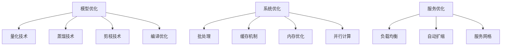

# 模型推理优化

> [!info] **性能关键**：大模型推理阶段的性能优化技术

## 🚀 推理优化概览



## 🎯 量化技术

### 1. 量化原理
```python
class QuantizationEngine:
    def __init__(self, model, quantization_config):
        self.model = model
        self.config = quantization_config
        
    def quantize_model(self):
        """
        模型量化
        """
        if self.config.quantization_type == 'dynamic':
            return self.dynamic_quantization()
        elif self.config.quantization_type == 'static':
            return self.static_quantization()
        elif self.config.quantization_type == 'qat':
            return self.quantization_aware_training()
        else:
            raise ValueError(f"Unknown quantization type: {self.config.quantization_type}")
    
    def dynamic_quantization(self):
        """
        动态量化
        """
        quantized_model = torch.quantization.quantize_dynamic(
            self.model,
            {torch.nn.Linear, torch.nn.Conv2d},
            dtype=torch.qint8
        )
        return quantized_model
    
    def static_quantization(self):
        """
        静态量化
        """
        # 准备校准数据
        calibration_data = self.prepare_calibration_data()
        
        # 设置量化配置
        self.model.qconfig = torch.quantization.get_default_qconfig('fbgemm')
        
        # 准备模型
        model_prepared = torch.quantization.prepare(self.model)
        
        # 校准
        self.calibrate_model(model_prepared, calibration_data)
        
        # 转换为量化模型
        quantized_model = torch.quantization.convert(model_prepared)
        
        return quantized_model
```

### 2. 量化精度选择
```python
def select_quantization_precision(model_size, latency_requirements, accuracy_requirements):
    """
    选择量化精度
    """
    quantization_options = {
        'FP32': {
            'bits': 32,
            'size_ratio': 1.0,
            'speedup': 1.0,
            'accuracy_drop': 0.0,
            'suitable_for': ['high_accuracy', 'research']
        },
        'FP16': {
            'bits': 16,
            'size_ratio': 0.5,
            'speedup': 2.0,
            'accuracy_drop': 0.01,
            'suitable_for': ['balanced', 'gpu_inference']
        },
        'INT8': {
            'bits': 8,
            'size_ratio': 0.25,
            'speedup': 4.0,
            'accuracy_drop': 0.02,
            'suitable_for': ['production', 'edge_devices']
        },
        'INT4': {
            'bits': 4,
            'size_ratio': 0.125,
            'speedup': 8.0,
            'accuracy_drop': 0.05,
            'suitable_for': ['mobile', 'extreme_compression']
        }
    }
    
    # 根据需求选择合适的量化精度
    suitable_options = []
    
    for precision, config in quantization_options.items():
        if (config['size_ratio'] * model_size <= latency_requirements['max_model_size'] and
            config['speedup'] >= latency_requirements['min_speedup'] and
            config['accuracy_drop'] <= accuracy_requirements['max_accuracy_drop']):
            suitable_options.append(precision)
    
    return suitable_options
```

## 🧠 知识蒸馏

### 1. 蒸馏原理
```python
class KnowledgeDistillation:
    def __init__(self, teacher_model, student_model, temperature=4.0, alpha=0.3):
        self.teacher_model = teacher_model
        self.student_model = student_model
        self.temperature = temperature
        self.alpha = alpha
        
        # 冻结教师模型
        for param in self.teacher_model.parameters():
            param.requires_grad = False
    
    def distillation_loss(self, student_logits, teacher_logits, true_labels):
        """
        蒸馏损失函数
        """
        # 学生模型与真实标签的损失
        hard_loss = F.cross_entropy(student_logits, true_labels)
        
        # 学生与教师模型的KL散度
        soft_loss = F.kl_div(
            F.log_softmax(student_logits / self.temperature, dim=1),
            F.softmax(teacher_logits / self.temperature, dim=1),
            reduction='batchmean'
        ) * (self.temperature ** 2)
        
        # 组合损失
        total_loss = self.alpha * soft_loss + (1 - self.alpha) * hard_loss
        
        return total_loss
    
    def train_student(self, train_loader, epochs=10):
        """
        训练学生模型
        """
        optimizer = torch.optim.Adam(self.student_model.parameters(), lr=1e-4)
        
        for epoch in range(epochs):
            self.student_model.train()
            total_loss = 0
            
            for batch in tqdm(train_loader, desc=f'Epoch {epoch}'):
                # 获取教师模型输出
                with torch.no_grad():
                    teacher_outputs = self.teacher_model(batch['input_ids'])
                
                # 获取学生模型输出
                student_outputs = self.student_model(batch['input_ids'])
                
                # 计算蒸馏损失
                loss = self.distillation_loss(
                    student_outputs.logits,
                    teacher_outputs.logits,
                    batch['labels']
                )
                
                # 反向传播
                loss.backward()
                optimizer.step()
                optimizer.zero_grad()
                
                total_loss += loss.item()
            
            avg_loss = total_loss / len(train_loader)
            print(f'Epoch {epoch}, Loss: {avg_loss:.4f}')
```

### 2. 架构蒸馏
```python
class ArchitecturalDistillation:
    def __init__(self, teacher_model, student_config):
        self.teacher_model = teacher_model
        self.student_config = student_config
        
    def create_student_model(self):
        """
        创建学生模型架构
        """
        # 根据教师模型创建更小的学生模型
        student_model = self.create_reduced_model(
            self.teacher_model,
            self.student_config
        )
        
        return student_model
    
    def create_reduced_model(self, teacher_model, config):
        """
        创建缩减的模型
        """
        # 减少层数
        if 'layer_reduction' in config:
            reduced_layers = teacher_model.config.num_hidden_layers - config['layer_reduction']
        
        # 减少隐藏层维度
        if 'hidden_size_reduction' in config:
            reduced_hidden_size = teacher_model.config.hidden_size - config['hidden_size_reduction']
        
        # 减少注意力头数
        if 'attention_heads_reduction' in config:
            reduced_attention_heads = teacher_model.config.num_attention_heads - config['attention_heads_reduction']
        
        # 创建新的配置
        student_config = teacher_model.config.copy()
        student_config.update({
            'num_hidden_layers': reduced_layers,
            'hidden_size': reduced_hidden_size,
            'num_attention_heads': reduced_attention_heads
        })
        
        # 创建学生模型
        student_model = teacher_model.__class__(student_config)
        
        return student_model
```

## ✂️ 模型剪枝

### 1. 结构化剪枝
```python
class StructuredPruning:
    def __init__(self, model, pruning_config):
        self.model = model
        self.config = pruning_config
        
    def prune_model(self):
        """
        结构化剪枝
        """
        # 计算重要性分数
        importance_scores = self.calculate_importance_scores()
        
        # 确定剪枝阈值
        pruning_threshold = self.determine_pruning_threshold(importance_scores)
        
        # 执行剪枝
        pruned_model = self.execute_pruning(pruning_threshold)
        
        return pruned_model
    
    def calculate_importance_scores(self):
        """
        计算重要性分数
        """
        importance_scores = {}
        
        for name, module in self.model.named_modules():
            if isinstance(module, torch.nn.Linear):
                # L1范数重要性
                weight_norm = torch.norm(module.weight, p=1, dim=1)
                importance_scores[name] = weight_norm
                
        return importance_scores
    
    def execute_pruning(self, threshold):
        """
        执行剪枝
        """
        pruned_model = copy.deepcopy(self.model)
        
        for name, module in pruned_model.named_modules():
            if isinstance(module, torch.nn.Linear) and name in self.importance_scores:
                # 获取重要性分数
                scores = self.importance_scores[name]
                
                # 确定要剪枝的神经元
                mask = scores > threshold
                
                # 应用剪枝
                module.weight.data = module.weight.data[mask]
                if module.bias is not None:
                    module.bias.data = module.bias.data[mask]
                
                # 更新下一层的输入维度
                self.update_next_layer_dimensions(pruned_model, name, mask.sum().item())
        
        return pruned_model
```

## 🔧 编译优化

### 1. TorchScript编译
```python
class TorchScriptCompiler:
    def __init__(self, model):
        self.model = model
        
    def compile_model(self, compilation_config):
        """
        编译模型为TorchScript
        """
        # 设置模型为评估模式
        self.model.eval()
        
        # 创建示例输入
        example_input = self.create_example_input()
        
        # 跟踪编译
        if compilation_config.get('tracing', True):
            traced_model = torch.jit.trace(self.model, example_input)
        
        # 脚本编译
        if compilation_config.get('scripting', False):
            scripted_model = torch.jit.script(self.model)
        
        # 优化编译后的模型
        optimized_model = self.optimize_compiled_model(
            traced_model if compilation_config.get('tracing', True) else scripted_model
        )
        
        return optimized_model
    
    def optimize_compiled_model(self, model):
        """
        优化编译后的模型
        """
        # 内联函数
        model = torch.jit.optimize_for_inference(model)
        
        # 冻结模型
        model = torch.jit.freeze(model)
        
        return model
```

### 2. ONNX导出和优化
```python
class ONNXExporter:
    def __init__(self, model):
        self.model = model
        
    def export_to_onnx(self, export_config):
        """
        导出为ONNX格式
        """
        # 设置模型为评估模式
        self.model.eval()
        
        # 创建示例输入
        example_input = self.create_example_input()
        
        # 导出ONNX
        torch.onnx.export(
            self.model,
            example_input,
            export_config['output_path'],
            export_params=True,
            opset_version=export_config.get('opset_version', 11),
            do_constant_folding=True,
            input_names=['input_ids', 'attention_mask'],
            output_names=['logits'],
            dynamic_axes={
                'input_ids': {0: 'batch_size', 1: 'sequence_length'},
                'attention_mask': {0: 'batch_size', 1: 'sequence_length'},
                'logits': {0: 'batch_size', 1: 'sequence_length'}
            }
        )
    
    def optimize_onnx(self, onnx_path):
        """
        优化ONNX模型
        """
        import onnx
        from onnxruntime.transformers import optimizer
        
        # 加载ONNX模型
        onnx_model = onnx.load(onnx_path)
        
        # 优化模型
        optimized_model = optimizer.optimize_model(
            onnx_path,
            model_type='bert',
            num_heads=12,
            hidden_size=768,
            opt_level=1,
            use_gpu=False
        )
        
        # 保存优化后的模型
        optimized_model.save_model_to_file(onnx_path.replace('.onnx', '_optimized.onnx'))
```

## 📊 系统优化

### 1. 批处理优化
```python
class BatchProcessor:
    def __init__(self, model, batch_config):
        self.model = model
        self.config = batch_config
        
    def dynamic_batching(self, requests):
        """
        动态批处理
        """
        # 按序列长度分组
        length_groups = self.group_by_length(requests)
        
        # 动态批处理
        batches = []
        for length_group in length_groups:
            batch = self.create_dynamic_batch(length_group)
            batches.append(batch)
        
        return batches
    
    def group_by_length(self, requests):
        """
        按序列长度分组
        """
        # 计算每个请求的序列长度
        lengths = [len(req['input_ids']) for req in requests]
        
        # 按长度分组
        groups = {}
        for req, length in zip(requests, lengths):
            group_key = (length - 1) // self.config.length_bucket_size
            if group_key not in groups:
                groups[group_key] = []
            groups[group_key].append(req)
        
        return list(groups.values())
    
    def create_dynamic_batch(self, requests):
        """
        创建动态批次
        """
        # 找到最大长度
        max_length = max(len(req['input_ids']) for req in requests)
        
        # 填充到相同长度
        padded_inputs = []
        attention_masks = []
        
        for req in requests:
            input_ids = req['input_ids']
            attention_mask = req['attention_mask']
            
            # 填充
            padding_length = max_length - len(input_ids)
            padded_input = input_ids + [0] * padding_length
            padded_mask = attention_mask + [0] * padding_length
            
            padded_inputs.append(padded_input)
            attention_masks.append(padded_mask)
        
        return {
            'input_ids': torch.tensor(padded_inputs),
            'attention_mask': torch.tensor(attention_masks),
            'requests': requests
        }
```

### 2. 缓存机制
```python
class InferenceCache:
    def __init__(self, cache_config):
        self.config = cache_config
        self.cache = {}
        self.access_stats = {}
        
    def get_cached_result(self, cache_key):
        """
        获取缓存结果
        """
        if cache_key in self.cache:
            # 更新访问统计
            self.access_stats[cache_key] = self.access_stats.get(cache_key, 0) + 1
            
            # 检查是否过期
            if self.is_cache_valid(cache_key):
                return self.cache[cache_key]['result']
            else:
                # 删除过期缓存
                del self.cache[cache_key]
                if cache_key in self.access_stats:
                    del self.access_stats[cache_key]
        
        return None
    
    def cache_result(self, cache_key, result):
        """
        缓存结果
        """
        self.cache[cache_key] = {
            'result': result,
            'timestamp': time.time(),
            'access_count': 0
        }
        
        # 检查缓存大小
        self.check_cache_size()
    
    def check_cache_size(self):
        """
        检查缓存大小
        """
        if len(self.cache) > self.config.max_cache_size:
            # 删除最久未使用的缓存
            oldest_key = min(
                self.cache.keys(),
                key=lambda k: self.cache[k]['timestamp']
            )
            del self.cache[oldest_key]
            if oldest_key in self.access_stats:
                del self.access_stats[oldest_key]
```

## 🎯 产品经理关注点

### 性能优化策略
```markdown
# 优化策略选择
## 延迟敏感场景
- **应用场景**: 实时对话、在线客服
- **优化重点**: 量化、蒸馏、批处理
- **可接受的精度损失**: 1-2%

## 吞吐量敏感场景
- **应用场景**: 批量处理、离线分析
- **优化重点**: 批处理、并行计算、缓存
- **可接受的精度损失**: 2-5%

## 资源受限场景
- **应用场景**: 移动端、边缘设备
- **优化重点**: 量化、剪枝、模型压缩
- **可接受的精度损失**: 3-10%
```

### 成本效益分析
```python
def optimization_cost_benefit_analysis(optimization_config):
    """
    优化成本效益分析
    """
    # 计算优化成本
    development_cost = optimization_config.development_hours * optimization_config.hourly_rate
    infrastructure_cost = optimization_config.infrastructure_cost
    
    # 计算优化收益
    performance_improvement = optimization_config.performance_improvement
    cost_savings = optimization_config.cost_savings
    user_satisfaction_improvement = optimization_config.user_satisfaction_improvement
    
    total_benefit = performance_improvement + cost_savings + user_satisfaction_improvement
    total_cost = development_cost + infrastructure_cost
    
    # ROI计算
    roi = (total_benefit - total_cost) / total_cost
    
    return {
        'roi': roi,
        'payback_period': total_cost / total_benefit * 12,  # 月
        'total_cost': total_cost,
        'total_benefit': total_benefit
    }
```

## 🔗 相关概念

- [[大模型关键技术栈]] - 优化技术在技术栈中的位置
- [[LLM完整生命周期]] - 优化在生命周期中的阶段
- [[训练推理原理]] - 推理优化的理论基础
- [[LoRA微调技术]] - 参数高效的微调方法

## 📝 最佳实践

### 技术实践
```markdown
# 技术最佳实践
1. **渐进式优化**: 从简单优化开始，逐步深入
2. **性能监控**: 持续监控性能指标
3. **A/B测试**: 对比不同优化策略的效果
4. **版本管理**: 管理不同优化版本的模型
```

### 产品实践
```markdown
# 产品最佳实践
1. **用户导向**: 以用户体验为核心
2. **数据驱动**: 基于数据做优化决策
3. **成本控制**: 平衡性能和成本
4. **持续改进**: 持续优化和迭代
```

---

*标签：#推理优化 #性能优化 #模型压缩 #AI产品经理*
*相关项目：[[AI产品经理技术栈项目]]*
*学习状态：#技术原理 🟡 #应用实践 🟡*