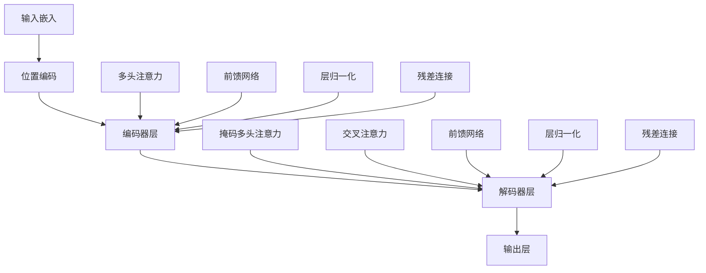

# Transformer架构解析

> [!info] **核心组件**：现代大语言模型的基石架构

## 🏗️ Transformer整体架构



## 🧠 核心组件详解

### 1. 输入嵌入层
```python
class InputEmbeddings(nn.Module):
    def __init__(self, vocab_size: int, d_model: int):
        super().__init__()
        self.d_model = d_model
        self.vocab_size = vocab_size
        self.embedding = nn.Embedding(vocab_size, d_model)

    def forward(self, x):
        return self.embedding(x) * math.sqrt(self.d_model)
```

### 2. 位置编码
```python
class PositionalEncoding(nn.Module):
    def __init__(self, d_model: int, seq_len: int, dropout: float = 0.1):
        super().__init__()
        self.d_model = d_model
        self.seq_len = seq_len
        self.dropout = nn.Dropout(dropout)
        
        # 创建位置编码矩阵
        pe = torch.zeros(seq_len, d_model)
        position = torch.arange(0, seq_len, dtype=torch.float).unsqueeze(1)
        div_term = torch.exp(torch.arange(0, d_model, 2).float() * 
                           (-math.log(10000.0) / d_model))
        
        # 使用sin和cos函数交替编码
        pe[:, 0::2] = torch.sin(position * div_term)
        pe[:, 1::2] = torch.cos(position * div_term)
        pe = pe.unsqueeze(0)
        
        self.register_buffer('pe', pe)

    def forward(self, x):
        x = x + (self.pe[:, :x.shape[1], :]).requires_grad_(False)
        return self.dropout(x)
```

### 3. 多头注意力机制
```python
class MultiHeadAttentionBlock(nn.Module):
    def __init__(self, d_model: int, h: int, dropout: float = 0.1):
        super().__init__()
        self.d_model = d_model
        self.h = h
        self.d_k = d_model // h  # 每个头的维度
        
        # Wq, Wk, Wv 矩阵
        self.w_q = nn.Linear(d_model, d_model, bias=False)
        self.w_k = nn.Linear(d_model, d_model, bias=False)
        self.w_v = nn.Linear(d_model, d_model, bias=False)
        
        # Wo 矩阵
        self.w_o = nn.Linear(d_model, d_model, bias=False)
        
        self.dropout = nn.Dropout(dropout)

    def forward(self, q, k, v, mask=None):
        query = self.w_q(q)  # (batch, seq_len, d_model)
        key = self.w_k(k)    # (batch, seq_len, d_model)
        value = self.w_v(v)  # (batch, seq_len, d_model)
        
        # 分割多头
        query = query.view(query.shape[0], query.shape[1], self.h, self.d_k).transpose(1, 2)
        key = key.view(key.shape[0], key.shape[1], self.h, self.d_k).transpose(1, 2)
        value = value.view(value.shape[0], value.shape[1], self.h, self.d_k).transpose(1, 2)
        
        # 计算注意力
        attention_scores = (query @ key.transpose(-2, -1)) / math.sqrt(self.d_k)
        
        if mask is not None:
            attention_scores.masked_fill_(mask == 0, -1e9)
        
        attention_probs = attention_scores.softmax(dim=-1)
        attention_probs = self.dropout(attention_probs)
        
        attention_output = attention_probs @ value
        attention_output = attention_output.transpose(1, 2).contiguous()
        attention_output = attention_output.view(attention_output.shape[0], attention_output.shape[1], self.d_model)
        
        # 输出投影
        return self.w_o(attention_output)
```

### 4. 前馈神经网络
```python
class FeedForwardBlock(nn.Module):
    def __init__(self, d_model: int, d_ff: int, dropout: float = 0.1):
        super().__init__()
        self.linear_1 = nn.Linear(d_model, d_ff)  # 第一线性层
        self.dropout = nn.Dropout(dropout)
        self.linear_2 = nn.Linear(d_ff, d_model)  # 第二线性层

    def forward(self, x):
        # (batch, seq_len, d_model) -> (batch, seq_len, d_ff) -> (batch, seq_len, d_model)
        return self.linear_2(self.dropout(torch.relu(self.linear_1(x))))
```

### 5. 残差连接和层归一化
```python
class ResidualConnection(nn.Module):
    def __init__(self, features: int, dropout: float = 0.1):
        super().__init__()
        self.dropout = nn.Dropout(dropout)
        self.norm = LayerNormalization(features)

    def forward(self, x, sublayer):
        return x + self.dropout(sublayer(self.norm(x)))

class LayerNormalization(nn.Module):
    def __init__(self, features: int, eps: float = 10**-6):
        super().__init__()
        self.eps = eps
        self.alpha = nn.Parameter(torch.ones(features))  # 缩放参数
        self.bias = nn.Parameter(torch.zeros(features))  # 偏移参数

    def forward(self, x):
        mean = x.mean(dim=-1, keepdim=True)
        std = x.std(dim=-1, keepdim=True)
        return self.alpha * (x - mean) / (std + self.eps) + self.bias
```

## 🏗️ 编码器层实现

```python
class EncoderBlock(nn.Module):
    def __init__(self, features: int, self_attention_block: MultiHeadAttentionBlock, 
                 feed_forward_block: FeedForwardBlock, dropout: float):
        super().__init__()
        self.self_attention_block = self_attention_block
        self.feed_forward_block = feed_forward_block
        self.residual_connections = nn.ModuleList([ResidualConnection(features, dropout) for _ in range(2)])

    def forward(self, x, src_mask):
        # 自注意力
        x = self.residual_connections[0](x, lambda x: self.self_attention_block(x, x, x, src_mask))
        # 前馈网络
        x = self.residual_connections[1](x, self.feed_forward_block)
        return x

class Encoder(nn.Module):
    def __init__(self, features: int, layers: nn.ModuleList):
        super().__init__()
        self.layers = layers
        self.norm = LayerNormalization(features)

    def forward(self, x, mask):
        for layer in self.layers:
            x = layer(x, mask)
        return self.norm(x)
```

## 🏗️ 解码器层实现

```python
class DecoderBlock(nn.Module):
    def __init__(self, features: int, self_attention_block: MultiHeadAttentionBlock,
                 cross_attention_block: MultiHeadAttentionBlock, feed_forward_block: FeedForwardBlock,
                 dropout: float):
        super().__init__()
        self.self_attention_block = self_attention_block
        self.cross_attention_block = cross_attention_block
        self.feed_forward_block = feed_forward_block
        self.residual_connections = nn.ModuleList([ResidualConnection(features, dropout) for _ in range(3)])

    def forward(self, x, encoder_output, src_mask, tgt_mask):
        # 自注意力（带掩码）
        x = self.residual_connections[0](x, lambda x: self.self_attention_block(x, x, x, tgt_mask))
        # 交叉注意力
        x = self.residual_connections[1](x, lambda x: self.cross_attention_block(x, encoder_output, encoder_output, src_mask))
        # 前馈网络
        x = self.residual_connections[2](x, self.feed_forward_block)
        return x

class Decoder(nn.Module):
    def __init__(self, features: int, layers: nn.ModuleList):
        super().__init__()
        self.layers = layers
        self.norm = LayerNormalization(features)

    def forward(self, x, encoder_output, src_mask, tgt_mask):
        for layer in self.layers:
            x = layer(x, encoder_output, src_mask, tgt_mask)
        return self.norm(x)
```

## 🎯 完整Transformer模型

```python
class Transformer(nn.Module):
    def __init__(self, src_embed: InputEmbeddings, tgt_embed: InputEmbeddings, 
                 src_pos: PositionalEncoding, tgt_pos: PositionalEncoding,
                 encoder: Encoder, decoder: Decoder, projection_layer: ProjectionLayer):
        super().__init__()
        self.src_embed = src_embed
        self.tgt_embed = tgt_embed
        self.src_pos = src_pos
        self.tgt_pos = tgt_pos
        self.encoder = encoder
        self.decoder = decoder
        self.projection_layer = projection_layer

    def encode(self, src, src_mask):
        # 源语言编码
        src = self.src_embed(src)
        src = self.src_pos(src)
        return self.encoder(src, src_mask)

    def decode(self, encoder_output: torch.Tensor, src_mask: torch.Tensor, 
              tgt: torch.Tensor, tgt_mask: torch.Tensor):
        # 目标语言解码
        tgt = self.tgt_embed(tgt)
        tgt = self.tgt_pos(tgt)
        return self.decoder(tgt, encoder_output, src_mask, tgt_mask)

    def project(self, x):
        # 输出投影
        return self.projection_layer(x)

def build_transformer(src_vocab_size: int, tgt_vocab_size: int, src_seq_len: int, 
                     tgt_seq_len: int, d_model: int = 512, N: int = 6, h: int = 8, 
                     dropout: float = 0.1, d_ff: int = 2048) -> Transformer:
    
    # 创建嵌入层
    src_embed = InputEmbeddings(src_vocab_size, d_model)
    tgt_embed = InputEmbeddings(tgt_vocab_size, d_model)
    
    # 创建位置编码
    src_pos = PositionalEncoding(d_model, src_seq_len, dropout)
    tgt_pos = PositionalEncoding(d_model, tgt_seq_len, dropout)
    
    # 创建编码器块
    encoder_blocks = []
    for _ in range(N):
        encoder_self_attention_block = MultiHeadAttentionBlock(d_model, h, dropout)
        feed_forward_block = FeedForwardBlock(d_model, d_ff, dropout)
        encoder_block = EncoderBlock(d_model, encoder_self_attention_block, feed_forward_block, dropout)
        encoder_blocks.append(encoder_block)
    
    # 创建解码器块
    decoder_blocks = []
    for _ in range(N):
        decoder_self_attention_block = MultiHeadAttentionBlock(d_model, h, dropout)
        decoder_cross_attention_block = MultiHeadAttentionBlock(d_model, h, dropout)
        feed_forward_block = FeedForwardBlock(d_model, d_ff, dropout)
        decoder_block = DecoderBlock(d_model, decoder_self_attention_block, 
                                   decoder_cross_attention_block, feed_forward_block, dropout)
        decoder_blocks.append(decoder_block)
    
    # 创建编码器和解码器
    encoder = Encoder(d_model, nn.ModuleList(encoder_blocks))
    decoder = Decoder(d_model, nn.ModuleList(decoder_blocks))
    
    # 创建投影层
    projection_layer = ProjectionLayer(d_model, tgt_vocab_size)
    
    # 创建Transformer
    transformer = Transformer(src_embed, tgt_embed, src_pos, tgt_pos, encoder, decoder, projection_layer)
    
    # 初始化参数
    for p in transformer.parameters():
        if p.dim() > 1:
            nn.init.xavier_uniform_(p)
    
    return transformer
```

## 📊 关键技术特性

### 1. 并行计算能力
```markdown
# 并行性优势
- **矩阵运算**: 所有注意力计算可以并行化
- **层间并行**: 编码器层之间可以并行计算
- **GPU友好**: 适合GPU加速计算
```

### 2. 长距离依赖
```markdown
# 长距离依赖处理
- **全局注意力**: 任意位置之间的直接连接
- **信息流动**: 无梯度消失问题
- **上下文理解**: 更好的长文本理解能力
```

### 3. 可扩展性
```markdown
# 扩展性优势
- **参数规模**: 可以轻松扩展到数十亿参数
- **数据效率**: 大规模数据训练效果好
- **迁移学习**: 预训练-微调范式成功
```

## 🎯 产品经理关注点

### 技术选型考虑
```markdown
# 选型决策因素
- **任务类型**: 理解vs生成vs翻译
- **计算资源**: 可用的GPU/TPU资源
- **延迟要求**: 实时性需求
- **质量要求**: 输出质量要求
```

### 成本分析
```python
def transformer_cost_analysis(config):
    # 计算复杂度
    n_params = config.d_model * config.d_model * 4 * config.n_layers  # 简化计算
    flops_per_token = n_params * 2
    
    # 训练成本
    training_flops = flops_per_token * config.dataset_size * config.n_epochs
    training_cost = training_flops / 1e12 * 0.006  # $0.006 per TFLOP
    
    # 推理成本
    inference_flops = flops_per_token * config.daily_requests
    inference_cost = inference_flops / 1e12 * 0.006
    
    return {
        'model_size_gb': n_params * 4 / 1e9,  # 假设float32
        'training_cost': training_cost,
        'daily_inference_cost': inference_cost,
        'total_monthly_cost': training_cost + inference_cost * 30
    }
```

### 应用场景
```markdown
# 应用场景分类
## 理解任务
- 文本分类、情感分析、命名实体识别
- 使用Encoder-only架构（如BERT）

## 生成任务
- 文本生成、对话系统、代码生成
- 使用Decoder-only架构（如GPT）

## 序列到序列任务
- 机器翻译、文本摘要、问答系统
- 使用Encoder-Decoder架构（如T5、BART）
```

## 🔗 相关概念

- [[大模型关键技术栈]] - Transformer在技术栈中的位置
- [[训练推理原理]] - 训练和推理的深度原理
- [[Transformer训练策略]] - 训练过程中的优化策略
- [[模型推理优化]] - 推理阶段的性能优化

## 📝 实践建议

### 技术实施
```markdown
# 实施建议
1. **从小开始**: 先用小规模模型验证
2. **逐步优化**: 持续优化模型性能
3. **监控指标**: 建立完善的监控体系
4. **版本管理**: 做好模型版本控制
```

### 产品建议
```markdown
# 产品建议
1. **用户需求**: 深入理解用户需求
2. **价值验证**: 验证技术价值
3. **快速迭代**: 敏捷开发和迭代
4. **数据驱动**: 基于数据做决策
```

---

*标签：#Transformer #深度学习 #模型架构 #AI产品经理*
*相关项目：[[AI产品经理技术栈项目]]*
*学习状态：#技术原理 🟡 #应用实践 🟡*