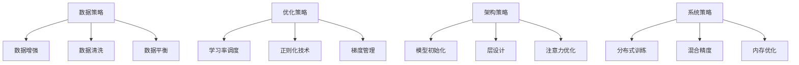

# Transformer训练策略

> [!info] **训练技巧**：Transformer模型的训练优化技巧和最佳实践

## 🎯 训练策略概览



## 📊 数据策略

### 1. 数据预处理
```python
class DataPreprocessor:
    def __init__(self, tokenizer, max_length=512):
        self.tokenizer = tokenizer
        self.max_length = max_length
    
    def preprocess_text(self, text):
        """
        文本预处理
        """
        # 基础清洗
        text = self.clean_text(text)
        
        # 标准化
        text = self.normalize_text(text)
        
        # 分词
        tokens = self.tokenizer.tokenize(text)
        
        # 截断或填充
        if len(tokens) > self.max_length - 2:  # 为特殊token留空间
            tokens = tokens[:self.max_length - 2]
        
        return tokens
    
    def clean_text(self, text):
        """
        文本清洗
        """
        import re
        
        # 移除HTML标签
        text = re.sub(r'<[^>]+>', '', text)
        
        # 移除多余的空白字符
        text = re.sub(r'\s+', ' ', text).strip()
        
        # 移除特殊字符
        text = re.sub(r'[^\w\s\.,!?;:\-\'\"]', '', text)
        
        return text
    
    def normalize_text(self, text):
        """
        文本标准化
        """
        # 转换为小写
        text = text.lower()
        
        # 数字标准化
        text = re.sub(r'\b\d+\b', '<NUM>', text)
        
        # URL标准化
        text = re.sub(r'http[s]?://\S+', '<URL>', text)
        
        # 邮箱标准化
        text = re.sub(r'\b[A-Za-z0-9._%+-]+@[A-Za-z0-9.-]+\.[A-Z|a-z]{2,}\b', '<EMAIL>', text)
        
        return text
```

### 2. 数据增强
```python
class DataAugmentation:
    def __init__(self, tokenizer, augmentation_prob=0.1):
        self.tokenizer = tokenizer
        self.augmentation_prob = augmentation_prob
    
    def augment_text(self, text):
        """
        文本数据增强
        """
        augmented_texts = [text]
        
        # 同义词替换
        if random.random() < self.augmentation_prob:
            augmented_texts.append(self.synonym_replacement(text))
        
        # 随机插入
        if random.random() < self.augmentation_prob:
            augmented_texts.append(self.random_insertion(text))
        
        # 随机删除
        if random.random() < self.augmentation_prob:
            augmented_texts.append(self.random_deletion(text))
        
        # 随机交换
        if random.random() < self.augmentation_prob:
            augmented_texts.append(self.random_swap(text))
        
        return augmented_texts
    
    def synonym_replacement(self, text, n=3):
        """
        同义词替换
        """
        words = text.split()
        new_words = words.copy()
        
        # 随机选择n个词进行替换
        random_word_list = list(set([word for word in words if word.isalpha()]))
        random.shuffle(random_word_list)
        
        num_replaced = 0
        for random_word in random_word_list:
            synonyms = self.get_synonyms(random_word)
            if len(synonyms) >= 1:
                synonym = random.choice(synonyms)
                new_words = [synonym if word == random_word else word for word in new_words]
                num_replaced += 1
            
            if num_replaced >= n:
                break
        
        return ' '.join(new_words)
    
    def random_insertion(self, text, n=1):
        """
        随机插入
        """
        words = text.split()
        for _ in range(n):
            new_word = self.get_random_word(words)
            if new_word:
                random_idx = random.randint(0, len(words))
                words.insert(random_idx, new_word)
        
        return ' '.join(words)
    
    def random_deletion(self, text, p=0.1):
        """
        随机删除
        """
        words = text.split()
        if len(words) == 1:
            return text
        
        new_words = []
        for word in words:
            if random.random() > p:
                new_words.append(word)
        
        if len(new_words) == 0:
            return random.choice(words)
        
        return ' '.join(new_words)
```

### 3. 动态数据采样
```python
class DynamicSampler:
    def __init__(self, dataset, sampling_strategy='balanced'):
        self.dataset = dataset
        self.sampling_strategy = sampling_strategy
        
    def create_sampler(self):
        """
        创建动态采样器
        """
        if self.sampling_strategy == 'balanced':
            return self.balanced_sampler()
        elif self.sampling_strategy == 'curriculum':
            return self.curriculum_sampler()
        elif self.sampling_strategy == 'difficulty':
            return self.difficulty_sampler()
        else:
            return RandomSampler(self.dataset)
    
    def balanced_sampler(self):
        """
        平衡采样器
        """
        # 计算每个类别的样本数
        class_counts = {}
        for item in self.dataset:
            label = item['label']
            class_counts[label] = class_counts.get(label, 0) + 1
        
        # 计算采样权重
        sample_weights = []
        for item in self.dataset:
            label = item['label']
            weight = 1.0 / class_counts[label]
            sample_weights.append(weight)
        
        # 创建加权采样器
        sampler = WeightedRandomSampler(
            weights=sample_weights,
            num_samples=len(sample_weights),
            replacement=True
        )
        
        return sampler
    
    def curriculum_sampler(self):
        """
        课程学习采样器
        """
        # 根据样本难度排序
        difficulties = []
        for item in self.dataset:
            difficulty = self.calculate_difficulty(item)
            difficulties.append(difficulty)
        
        # 按难度排序索引
        sorted_indices = np.argsort(difficulties)
        
        # 创建采样器
        sampler = SubsetRandomSampler(sorted_indices)
        
        return sampler
```

## 🚀 优化策略

### 1. 学习率调度
```python
class LearningRateScheduler:
    def __init__(self, optimizer, warmup_steps=1000, total_steps=10000, 
                 scheduler_type='cosine', min_lr=1e-6):
        self.optimizer = optimizer
        self.warmup_steps = warmup_steps
        self.total_steps = total_steps
        self.scheduler_type = scheduler_type
        self.min_lr = min_lr
        self.step_count = 0
    
    def step(self):
        """
        更新学习率
        """
        self.step_count += 1
        lr = self.get_lr()
        
        for param_group in self.optimizer.param_groups:
            param_group['lr'] = lr
    
    def get_lr(self):
        """
        获取当前学习率
        """
        if self.step_count < self.warmup_steps:
            # Warmup阶段
            lr = self.step_count / self.warmup_steps
        else:
            # Decay阶段
            progress = (self.step_count - self.warmup_steps) / (self.total_steps - self.warmup_steps)
            
            if self.scheduler_type == 'linear':
                lr = 1.0 - progress
            elif self.scheduler_type == 'cosine':
                lr = 0.5 * (1 + torch.cos(torch.pi * progress))
            elif self.scheduler_type == 'exponential':
                lr = 0.1 ** progress
            elif self.scheduler_type == 'polynomial':
                lr = (1 - progress) ** 2
            else:
                lr = 1.0 - progress
        
        # 确保学习率不低于最小值
        lr = max(lr, self.min_lr)
        
        return lr

class CustomOptimizer:
    def __init__(self, model, lr=1e-4, weight_decay=0.01, betas=(0.9, 0.999)):
        self.model = model
        self.lr = lr
        self.weight_decay = weight_decay
        self.betas = betas
        
        # 初始化优化器状态
        self.state = {}
        self.step_count = 0
    
    def zero_grad(self):
        """
        清零梯度
        """
        for param in self.model.parameters():
            if param.grad is not None:
                param.grad.zero_()
    
    def step(self):
        """
        优化步骤
        """
        self.step_count += 1
        
        for param in self.model.parameters():
            if param.grad is None:
                continue
            
            grad = param.grad
            
            # 获取或初始化状态
            if param not in self.state:
                self.state[param] = {
                    'm': torch.zeros_like(param),
                    'v': torch.zeros_like(param)
                }
            
            state = self.state[param]
            
            # 更新一阶矩估计
            state['m'] = self.betas[0] * state['m'] + (1 - self.betas[0]) * grad
            
            # 更新二阶矩估计
            state['v'] = self.betas[1] * state['v'] + (1 - self.betas[1]) * grad**2
            
            # 偏差校正
            m_hat = state['m'] / (1 - self.betas[0]**self.step_count)
            v_hat = state['v'] / (1 - self.betas[1]**self.step_count)
            
            # 参数更新
            param.data = param.data - self.lr * m_hat / (torch.sqrt(v_hat) + 1e-8)
            
            # 添加权重衰减
            if self.weight_decay > 0:
                param.data = param.data - self.lr * self.weight_decay * param
```

### 2. 正则化技术
```python
class Regularization:
    def __init__(self, model, dropout_rate=0.1, layer_norm_eps=1e-12):
        self.model = model
        self.dropout_rate = dropout_rate
        self.layer_norm_eps = layer_norm_eps
    
    def apply_dropout(self, x):
        """
        应用Dropout
        """
        return torch.nn.functional.dropout(x, p=self.dropout_rate, training=self.model.training)
    
    def apply_layer_norm(self, x):
        """
        应用Layer Normalization
        """
        return torch.nn.functional.layer_norm(
            x, 
            normalized_shape=x.shape[-1:], 
            eps=self.layer_norm_eps
        )
    
    def calculate_regularization_loss(self, l1_lambda=0.0, l2_lambda=0.0):
        """
        计算正则化损失
        """
        l1_loss = 0
        l2_loss = 0
        
        for param in self.model.parameters():
            if param.requires_grad:
                if l1_lambda > 0:
                    l1_loss += torch.norm(param, p=1)
                
                if l2_lambda > 0:
                    l2_loss += torch.norm(param, p=2) ** 2
        
        total_loss = l1_lambda * l1_loss + 0.5 * l2_lambda * l2_loss
        
        return total_loss

class EarlyStopping:
    def __init__(self, patience=10, min_delta=1e-4, mode='min'):
        self.patience = patience
        self.min_delta = min_delta
        self.mode = mode
        self.best_score = None
        self.counter = 0
        self.early_stop = False
    
    def __call__(self, score):
        """
        检查是否应该早停
        """
        if self.best_score is None:
            self.best_score = score
        elif self._is_better(score, self.best_score):
            self.best_score = score
            self.counter = 0
        else:
            self.counter += 1
            if self.counter >= self.patience:
                self.early_stop = True
        
        return self.early_stop
    
    def _is_better(self, score, best_score):
        """
        判断是否更好
        """
        if self.mode == 'min':
            return score < best_score - self.min_delta
        else:
            return score > best_score + self.min_delta
```

## 🏗️ 架构策略

### 1. 模型初始化
```python
class ModelInitialization:
    @staticmethod
    def xavier_uniform_init(tensor):
        """
        Xavier均匀初始化
        """
        fan_in, fan_out = tensor.shape
        bound = math.sqrt(6.0 / (fan_in + fan_out))
        torch.nn.init.uniform_(tensor, -bound, bound)
    
    @staticmethod
    def xavier_normal_init(tensor):
        """
        Xavier正态初始化
        """
        fan_in, fan_out = tensor.shape
        std = math.sqrt(2.0 / (fan_in + fan_out))
        torch.nn.init.normal_(tensor, 0, std)
    
    @staticmethod
    def kaiming_uniform_init(tensor, mode='fan_in', nonlinearity='relu'):
        """
        Kaiming均匀初始化
        """
        fan = torch.nn.init._calculate_correct_fan(tensor, mode)
        gain = torch.nn.init.calculate_gain(nonlinearity)
        std = gain / math.sqrt(fan)
        bound = math.sqrt(3.0) * std
        torch.nn.init.uniform_(tensor, -bound, bound)
    
    @staticmethod
    def kaiming_normal_init(tensor, mode='fan_in', nonlinearity='relu'):
        """
        Kaiming正态初始化
        """
        fan = torch.nn.init._calculate_correct_fan(tensor, mode)
        gain = torch.nn.init.calculate_gain(nonlinearity)
        std = gain / math.sqrt(fan)
        torch.nn.init.normal_(tensor, 0, std)
    
    @staticmethod
    def pretrained_init(model, pretrained_model):
        """
        预训练权重初始化
        """
        pretrained_dict = pretrained_model.state_dict()
        model_dict = model.state_dict()
        
        # 过滤不匹配的层
        pretrained_dict = {k: v for k, v in pretrained_dict.items() 
                         if k in model_dict and v.shape == model_dict[k].shape}
        
        # 更新模型权重
        model_dict.update(pretrained_dict)
        model.load_state_dict(model_dict)
        
        return model
```

### 2. 注意力机制优化
```python
class AttentionOptimization:
    def __init__(self, model, attention_type='scaled_dot_product'):
        self.model = model
        self.attention_type = attention_type
    
    def optimized_attention(self, query, key, value, mask=None):
        """
        优化的注意力计算
        """
        if self.attention_type == 'scaled_dot_product':
            return self.scaled_dot_product_attention(query, key, value, mask)
        elif self.attention_type == 'flash_attention':
            return self.flash_attention(query, key, value, mask)
        elif self.attention_type == 'linear_attention':
            return self.linear_attention(query, key, value, mask)
        else:
            raise ValueError(f"Unknown attention type: {self.attention_type}")
    
    def scaled_dot_product_attention(self, query, key, value, mask=None):
        """
        标准缩放点积注意力
        """
        d_k = query.size(-1)
        scores = torch.matmul(query, key.transpose(-2, -1)) / math.sqrt(d_k)
        
        if mask is not None:
            scores = scores.masked_fill(mask == 0, -1e9)
        
        attention_weights = torch.softmax(scores, dim=-1)
        
        output = torch.matmul(attention_weights, value)
        
        return output, attention_weights
    
    def flash_attention(self, query, key, value, mask=None):
        """
        Flash Attention（内存高效的注意力）
        """
        # 这里实现Flash Attention的简化版本
        # 实际应用中建议使用官方实现
        
        batch_size, num_heads, seq_len, d_k = query.shape
        
        # 分块处理
        block_size = 64
        output = torch.zeros_like(query)
        
        for i in range(0, seq_len, block_size):
            for j in range(0, seq_len, block_size):
                # 处理当前块
                q_block = query[:, :, i:i+block_size, :]
                k_block = key[:, :, j:j+block_size, :]
                v_block = value[:, :, j:j+block_size, :]
                
                # 计算注意力
                scores = torch.matmul(q_block, k_block.transpose(-2, -1)) / math.sqrt(d_k)
                
                if mask is not None:
                    mask_block = mask[:, :, i:i+block_size, j:j+block_size]
                    scores = scores.masked_fill(mask_block == 0, -1e9)
                
                attention_weights = torch.softmax(scores, dim=-1)
                output[:, :, i:i+block_size, :] += torch.matmul(attention_weights, v_block)
        
        return output, attention_weights
    
    def linear_attention(self, query, key, value, mask=None):
        """
        线性注意力（降低复杂度）
        """
        # 使用核函数近似
        phi_query = torch.exp(query)
        phi_key = torch.exp(key)
        
        # 计算注意力权重
        attention_weights = torch.matmul(phi_query, phi_key.transpose(-2, -1))
        
        if mask is not None:
            attention_weights = attention_weights.masked_fill(mask == 0, 0)
        
        # 归一化
        attention_weights = attention_weights / (attention_weights.sum(dim=-1, keepdim=True) + 1e-8)
        
        output = torch.matmul(attention_weights, value)
        
        return output, attention_weights
```

## 💻 系统策略

### 1. 分布式训练
```python
class DistributedTrainer:
    def __init__(self, model, config):
        self.model = model
        self.config = config
        self.setup_distributed()
    
    def setup_distributed(self):
        """
        设置分布式训练
        """
        if self.config.distributed:
            torch.distributed.init_process_group(backend='nccl')
            local_rank = int(os.environ.get('LOCAL_RANK', 0))
            torch.cuda.set_device(local_rank)
            
            # 包装模型
            self.model = torch.nn.parallel.DistributedDataParallel(
                self.model,
                device_ids=[local_rank],
                output_device=local_rank
            )
    
    def train_epoch(self, dataloader, epoch):
        """
        训练一个epoch
        """
        self.model.train()
        
        if self.config.distributed:
            dataloader.sampler.set_epoch(epoch)
        
        total_loss = 0
        num_batches = len(dataloader)
        
        progress_bar = tqdm(dataloader, desc=f'Epoch {epoch}')
        
        for batch_idx, batch in enumerate(progress_bar):
            # 数据移到设备
            batch = self.move_to_device(batch)
            
            # 前向传播
            outputs = self.model(**batch)
            loss = outputs.loss
            
            # 反向传播
            loss.backward()
            
            # 梯度同步（分布式）
            if self.config.distributed:
                self.model.reduce_gradients()
            
            # 梯度裁剪
            torch.nn.utils.clip_grad_norm_(self.model.parameters(), 1.0)
            
            # 参数更新
            self.optimizer.step()
            self.optimizer.zero_grad()
            
            # 学习率调度
            self.scheduler.step()
            
            # 记录损失
            total_loss += loss.item()
            
            # 更新进度条
            progress_bar.set_postfix({
                'loss': loss.item(),
                'lr': self.scheduler.get_lr()
            })
        
        avg_loss = total_loss / num_batches
        return avg_loss
```

### 2. 混合精度训练
```python
class MixedPrecisionTrainer:
    def __init__(self, model, optimizer, scaler=None):
        self.model = model
        self.optimizer = optimizer
        self.scaler = scaler or torch.cuda.amp.GradScaler()
    
    def train_step(self, batch):
        """
        混合精度训练步骤
        """
        # 前向传播（自动混合精度）
        with torch.cuda.amp.autocast():
            outputs = self.model(**batch)
            loss = outputs.loss
        
        # 反向传播（使用scaler）
        self.scaler.scale(loss).backward()
        
        # 梯度裁剪
        torch.nn.utils.clip_grad_norm_(self.model.parameters(), 1.0)
        
        # 优化器步骤（使用scaler）
        self.scaler.step(self.optimizer)
        self.scaler.update()
        
        # 清零梯度
        self.optimizer.zero_grad()
        
        return loss.item()
    
    def evaluate(self, dataloader):
        """
        评估步骤
        """
        self.model.eval()
        total_loss = 0
        
        with torch.no_grad():
            for batch in tqdm(dataloader, desc='Evaluating'):
                with torch.cuda.amp.autocast():
                    outputs = self.model(**batch)
                    loss = outputs.loss
                
                total_loss += loss.item()
        
        avg_loss = total_loss / len(dataloader)
        return avg_loss
```

## 🎯 产品经理关注点

### 训练策略选择
```markdown
# 策略选择框架
## 小规模训练
- **单GPU训练**: 适合小模型和小数据集
- **混合精度**: 减少内存占用
- **梯度累积**: 模拟大批量训练

## 中等规模训练
- **多GPU数据并行**: 适合中等规模模型
- **分布式训练**: 提高训练效率
- **模型并行**: 处理大模型

## 大规模训练
- **模型并行**: 处理超大模型
- **流水线并行**: 提高设备利用率
- **混合并行**: 数据并行+模型并行
```

### 成本效益分析
```python
def training_strategy_cost_analysis(config):
    """
    训练策略成本分析
    """
    # 计算硬件成本
    gpu_cost = config.num_gpus * config.gpu_hours * config.gpu_cost_per_hour
    storage_cost = config.storage_gb * config.storage_cost_per_gb_per_month
    network_cost = config.network_bandwidth * config.network_cost_per_gb
    
    total_hardware_cost = gpu_cost + storage_cost + network_cost
    
    # 计算人力成本
    development_cost = config.development_hours * config.hourly_rate
    maintenance_cost = config.maintenance_hours * config.hourly_rate
    
    total_human_cost = development_cost + maintenance_cost
    
    # 计算效益
    training_time_reduction = config.training_time_reduction
    model_performance_improvement = config.model_performance_improvement
    deployment_efficiency = config.deployment_efficiency
    
    total_benefit = training_time_reduction + model_performance_improvement + deployment_efficiency
    
    return {
        'total_cost': total_hardware_cost + total_human_cost,
        'total_benefit': total_benefit,
        'roi': (total_benefit - (total_hardware_cost + total_human_cost)) / (total_hardware_cost + total_human_cost),
        'payback_period': (total_hardware_cost + total_human_cost) / total_benefit * 12  # 月
    }
```

## 🔗 相关概念

- [[Transformer架构解析]] - Transformer架构的详细解析
- [[大模型关键技术栈]] - 训练策略在技术栈中的位置
- [[训练推理原理]] - 训练过程的理论基础
- [[模型推理优化]] - 推理阶段的优化技术

## 📝 最佳实践

### 技术实践
```markdown
# 技术最佳实践
1. **渐进式训练**: 从小规模开始，逐步扩大
2. **监控指标**: 实时监控训练指标
3. **实验管理**: 系统管理实验和结果
4. **版本控制**: 管理模型和代码版本
```

### 产品实践
```markdown
# 产品最佳实践
1. **需求导向**: 根据产品需求选择策略
2. **成本控制**: 平衡性能和成本
3. **时间管理**: 合理安排训练时间
4. **质量保证**: 确保模型质量
```

---

*标签：#Transformer #训练策略 #优化技术 #AI产品经理*
*相关项目：[[AI产品经理技术栈项目]]*
*学习状态：#技术原理 🟡 #应用实践 🟡*