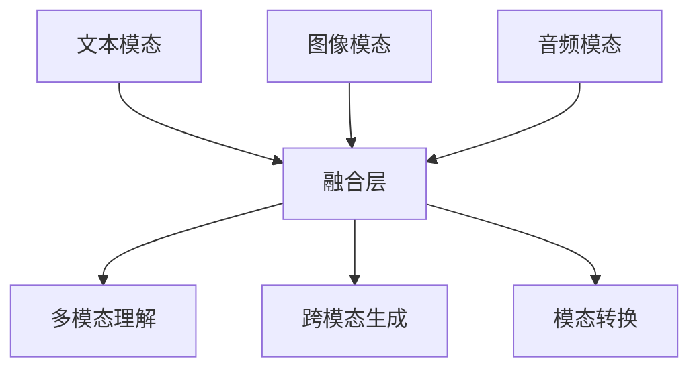

# 多模态融合技术

> [!info] **跨模态对齐**：解决不同模态之间差异的关键技术

## 🌐 多模态融合概述



## 🔧 核心技术方法

### 1. 早期融合 (Early Fusion)
```python
class EarlyFusion(nn.Module):
    def __init__(self, text_dim=768, image_dim=512, fusion_dim=1024):
        super().__init__()
        self.text_proj = nn.Linear(text_dim, fusion_dim)
        self.image_proj = nn.Linear(image_dim, fusion_dim)
        self.fusion_layer = nn.Sequential(
            nn.Linear(fusion_dim * 2, fusion_dim),
            nn.ReLU(),
            nn.Dropout(0.1)
        )
        
    def forward(self, text_features, image_features):
        # 投影到同一空间
        text_proj = self.text_proj(text_features)
        image_proj = self.image_proj(image_features)
        
        # 拼接特征
        fused_features = torch.cat([text_proj, image_proj], dim=-1)
        
        # 融合层
        output = self.fusion_layer(fused_features)
        return output
```

### 2. 晚期融合 (Late Fusion)
```python
class LateFusion(nn.Module):
    def __init__(self, text_dim=768, image_dim=512, output_dim=512):
        super().__init__()
        self.text_encoder = nn.Sequential(
            nn.Linear(text_dim, output_dim),
            nn.ReLU(),
            nn.Dropout(0.1)
        )
        self.image_encoder = nn.Sequential(
            nn.Linear(image_dim, output_dim),
            nn.ReLU(),
            nn.Dropout(0.1)
        )
        self.fusion_weight = nn.Parameter(torch.ones(2))
        
    def forward(self, text_features, image_features):
        # 分别处理每个模态
        text_encoded = self.text_encoder(text_features)
        image_encoded = self.image_encoder(image_features)
        
        # 加权融合
        weights = F.softmax(self.fusion_weight, dim=0)
        fused = weights[0] * text_encoded + weights[1] * image_encoded
        
        return fused
```

### 3. 跨模态注意力 (Cross-Modal Attention)
```python
class CrossModalAttention(nn.Module):
    def __init__(self, embed_dim=768, num_heads=8):
        super().__init__()
        self.embed_dim = embed_dim
        self.num_heads = num_heads
        self.head_dim = embed_dim // num_heads
        
        # 跨模态注意力
        self.cross_attention = nn.MultiheadAttention(embed_dim, num_heads)
        self.norm1 = nn.LayerNorm(embed_dim)
        self.norm2 = nn.LayerNorm(embed_dim)
        self.dropout = nn.Dropout(0.1)
        
        # 前馈网络
        self.ffn = nn.Sequential(
            nn.Linear(embed_dim, embed_dim * 4),
            nn.ReLU(),
            nn.Linear(embed_dim * 4, embed_dim),
            nn.Dropout(0.1)
        )
        
    def forward(self, query, key, value, key_padding_mask=None):
        # 跨模态注意力
        attn_output, _ = self.cross_attention(
            query, key, value, 
            key_padding_mask=key_padding_mask
        )
        
        # 残差连接和层归一化
        query = self.norm1(query + self.dropout(attn_output))
        
        # 前馈网络
        ffn_output = self.ffn(query)
        query = self.norm2(query + self.dropout(ffn_output))
        
        return query
```

## 🎯 关键技术挑战

### 1. 模态差异对齐
```python
class ModalityAlignment(nn.Module):
    def __init__(self, text_dim=768, image_dim=512, shared_dim=512):
        super().__init__()
        self.text_to_shared = nn.Linear(text_dim, shared_dim)
        self.image_to_shared = nn.Linear(image_dim, shared_dim)
        
        # 对比学习损失
        self.temperature = nn.Parameter(torch.ones([]) * 0.07)
        
    def forward(self, text_features, image_features):
        # 投影到共享空间
        text_shared = F.normalize(self.text_to_shared(text_features), dim=-1)
        image_shared = F.normalize(self.image_to_shared(image_features), dim=-1)
        
        return text_shared, image_shared
    
    def contrastive_loss(self, text_shared, image_shared):
        # 计算相似度矩阵
        logits = torch.matmul(text_shared, image_shared.transpose(0, 1)) / self.temperature
        
        # 对比学习损失
        batch_size = text_shared.size(0)
        labels = torch.arange(batch_size).to(text_shared.device)
        
        loss_i2t = F.cross_entropy(logits, labels)
        loss_t2i = F.cross_entropy(logits.transpose(0, 1), labels)
        
        return (loss_i2t + loss_t2i) / 2
```

### 2. 统一表示空间
```python
class UnifiedRepresentationSpace(nn.Module):
    def __init__(self, modalities=['text', 'image', 'audio'], embed_dim=768):
        super().__init__()
        self.modalities = modalities
        self.embed_dim = embed_dim
        
        # 每个模态的编码器
        self.encoders = nn.ModuleDict({
            modality: nn.Sequential(
                nn.Linear(self.get_modality_dim(modality), embed_dim),
                nn.ReLU(),
                nn.LayerNorm(embed_dim)
            ) for modality in modalities
        })
        
        # 模态特定的投影
        self.projections = nn.ModuleDict({
            modality: nn.Linear(embed_dim, embed_dim) 
            for modality in modalities
        })
        
    def get_modality_dim(self, modality):
        dim_map = {'text': 768, 'image': 512, 'audio': 256}
        return dim_map.get(modality, 512)
    
    def forward(self, modality_features):
        unified_features = {}
        
        for modality, features in modality_features.items():
            if modality in self.encoders:
                encoded = self.encoders[modality](features)
                projected = self.projections[modality](encoded)
                unified_features[modality] = projected
                
        return unified_features
```

## 🚀 主流多模态模型架构

### 1. CLIP架构
```python
class CLIPModel(nn.Module):
    def __init__(self, text_model='bert-base', image_model='vit-base', embed_dim=512):
        super().__init__()
        
        # 文本编码器
        self.text_encoder = TextEncoder(text_model)
        self.text_projection = nn.Linear(self.text_encoder.output_dim, embed_dim)
        
        # 图像编码器
        self.image_encoder = ImageEncoder(image_model)
        self.image_projection = nn.Linear(self.image_encoder.output_dim, embed_dim)
        
        # 温度参数
        self.logit_scale = nn.Parameter(torch.ones([]) * np.log(1 / 0.07))
        
    def forward(self, text, image):
        # 获取特征
        text_features = self.text_encoder(text)
        image_features = self.image_encoder(image)
        
        # 投影到共享空间
        text_embed = self.text_projection(text_features)
        image_embed = self.image_projection(image_features)
        
        # 归一化
        text_embed = F.normalize(text_embed, dim=-1)
        image_embed = F.normalize(image_embed, dim=-1)
        
        return text_embed, image_embed
    
    def contrastive_loss(self, text_embed, image_embed):
        # 计算logits
        logits_per_text = torch.matmul(text_embed, image_embed.t()) * self.logit_scale.exp()
        logits_per_image = logits_per_text.t()
        
        # 计算对比损失
        batch_size = text_embed.shape[0]
        labels = torch.arange(batch_size).to(text_embed.device)
        
        loss_text = F.cross_entropy(logits_per_text, labels)
        loss_image = F.cross_entropy(logits_per_image, labels)
        
        return (loss_text + loss_image) / 2
```

### 2. Flamingo架构
```python
class FlamingoModel(nn.Module):
    def __init__(self, vision_encoder, lang_model, adapter_dim=64):
        super().__init__()
        self.vision_encoder = vision_encoder
        self.lang_model = lang_model
        
        # 交叉注意力适配器
        self.cross_attention_layers = nn.ModuleList([
            CrossAttentionAdapter(adapter_dim) 
            for _ in range(lang_model.config.num_hidden_layers)
        ])
        
        # 门控机制
        self.gating_layers = nn.ModuleList([
            nn.Linear(adapter_dim, 1) 
            for _ in range(lang_model.config.num_hidden_layers)
        ])
        
    def forward(self, vision_x, lang_x):
        # 视觉特征提取
        vision_features = self.vision_encoder(vision_x)
        
        # 逐层处理
        for i, (layer, cross_attn, gate) in enumerate(zip(
            self.lang_model.transformer.layer,
            self.cross_attention_layers,
            self.gating_layers
        )):
            # 标准语言模型层
            lang_output = layer(lang_x)
            
            # 跨模态注意力
            cross_output = cross_attn(lang_output, vision_features)
            
            # 门控融合
            gate_weight = torch.sigmoid(gate(lang_output))
            lang_x = lang_output + gate_weight * cross_output
            
        return lang_x
```

## 📊 性能评估指标

### 1. 跨模态检索
```python
def evaluate_cross_modal_retrieval(model, test_loader, device):
    model.eval()
    
    text_to_image_recall = []
    image_to_text_recall = []
    
    with torch.no_grad():
        for batch in test_loader:
            text_features, image_features = model(batch['text'], batch['image'])
            
            # 计算相似度矩阵
            similarity = torch.matmul(text_features, image_features.t())
            
            # 计算Recall@K
            for k in [1, 5, 10]:
                # Text-to-Image
                _, top_k_indices = similarity.topk(k, dim=1)
                recall_k = calculate_recall(top_k_indices, batch['labels'])
                text_to_image_recall.append(recall_k)
                
                # Image-to-Text
                _, top_k_indices = similarity.t().topk(k, dim=1)
                recall_k = calculate_recall(top_k_indices, batch['labels'])
                image_to_text_recall.append(recall_k)
    
    return {
        'text_to_image_recall@1': np.mean(text_to_image_recall),
        'text_to_image_recall@5': np.mean(text_to_image_recall),
        'text_to_image_recall@10': np.mean(text_to_image_recall),
        'image_to_text_recall@1': np.mean(image_to_text_recall),
        'image_to_text_recall@5': np.mean(image_to_text_recall),
        'image_to_text_recall@10': np.mean(image_to_text_recall),
    }
```

### 2. 视觉问答
```python
def evaluate_vqa(model, test_loader, device):
    model.eval()
    
    predictions = []
    references = []
    
    with torch.no_grad():
        for batch in test_loader:
            # 模型预测
            outputs = model(
                image=batch['image'],
                question=batch['question']
            )
            
            # 获取预测答案
            predicted_answers = outputs.predictions
            predicted_answers = [model.tokenizer.decode(ans) for ans in predicted_answers]
            
            predictions.extend(predicted_answers)
            references.extend(batch['answers'])
    
    # 计算准确率
    accuracy = calculate_accuracy(predictions, references)
    
    return {
        'vqa_accuracy': accuracy,
        'bleu_score': calculate_bleu(predictions, references),
        'rouge_score': calculate_rouge(predictions, references)
    }
```

## 🎯 产品经理关注点

### 技术选型决策
```markdown
# 选型框架
## 应用场景匹配
- **检索任务**: CLIP, ALIGN
- **生成任务**: DALL-E, Stable Diffusion
- **理解任务**: Flamingo, BLIP
- **对话任务**: GPT-4V, Gemini

## 成本考虑
- **训练成本**: 大模型vs小模型
- **推理成本**: API调用vs自建部署
- **维护成本**: 模型更新和监控
```

### 用户体验设计
```markdown
# UX设计要点
- **响应时间**: 多模态处理速度
- **结果质量**: 跨模态理解准确性
- **交互方式**: 自然交互设计
- **错误处理**: 优雅的错误处理
```

### 商业模式
```markdown
# 商业模式选择
- **API服务**: 按调用次数计费
- **企业定制**: 行业解决方案
- **平台化**: 多模态能力平台
- **垂直应用**: 特定行业深度应用
```

## 🔗 相关概念

- [[图像Token化]] - 视觉数据的Token化技术
- [[多模态模型全景]] - 多模态模型的整体架构
- [[多模态理解能力]] - 多模态系统的能力建设
- [[多模态发展历程]] - 技术演进路线

## 📝 实践建议

### 技术实施
```markdown
# 实施建议
1. **数据质量**: 高质量多模态数据
2. **预训练**: 利用预训练模型
3. **微调**: 针对特定场景微调
4. **评估**: 建立完善评估体系
```

### 产品建议
```markdown
# 产品建议
1. **场景验证**: 验证技术价值
2. **用户研究**: 深入用户需求
3. **MVP验证**: 最小可行产品验证
4. **迭代优化**: 持续优化体验
```

---

*标签：#多模态 #融合技术 #深度学习 #AI产品经理*
*相关项目：[[AI产品经理技术栈项目]]*
*学习状态：#技术原理 🟡 #应用实践 🔴*