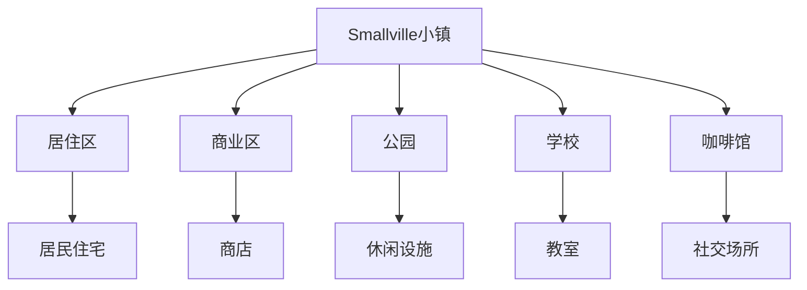
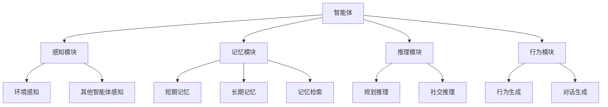

# 实验: AI社群 - 斯坦福小镇实验

**标签**: #论文 #实验 #社会学 #LLM协作 #未来研究
**来源**: [[MOC - 大语言模型协作 (LLM Collaboration)]]

> [!abstract] 核心概念
> 这是一个由斯坦福大学进行的影响深远的实验。研究人员在一个名为"Smallville"的虚拟小镇中，放入了25个由LLM驱动的智能体。每个智能体都有自己的身份、记忆和日常规划。实验证明，这些AI智能体可以自发地进行复杂的社会互动，如举办派对、传播八卦、形成人际关系，甚至展现出类似"恋爱"的行为。

## 🏘️ 实验概述

### 基本信息
- **实验名称**：Smallville（小镇）
- **研究机构**：斯坦福大学
- **发表时间**：2023年
- **论文标题**："Generative Agents: Interactive Simulacra of Human Behavior"
- **智能体数量**：25个
- **实验时长**：连续运行多天

### 实验目标
- **社会行为模拟**：观察AI智能体的社会行为
- **交互模式研究**：研究智能体间的交互模式
- **涌现行为观察**：观察是否会出现涌现行为
- **可信度验证**：验证AI行为的可信度

## 🎯 实验设计

### 1. 虚拟环境设计
#### 小镇布局

#### 环境规则
- **空间约束**：智能体在物理空间中的移动限制
- **时间流逝**：模拟真实的时间流逝（日夜循环）
- **物体交互**：智能体与环境的交互规则
- **社交规则**：社交互动的基本规则

### 2. 智能体设计
#### 智能体架构

#### 记忆系统
- **记忆类型**：
  - **情景记忆**：具体事件和经历
  - **语义记忆**：知识和概念
  - **程序记忆**：技能和习惯
- **记忆检索**：基于相关性检索记忆
- **记忆衰减**：记忆随时间衰减
- **记忆巩固**：重要记忆的强化

#### 规划系统
- **层次化规划**：长期目标→中期计划→短期行动
- **动态调整**：根据环境变化调整计划
- **优先级管理**：根据重要性管理任务优先级

### 3. 交互机制
#### 对话系统
- **自然语言**：使用自然语言进行对话
- **上下文理解**：理解对话上下文
- **情感表达**：在对话中表达情感

#### 非语言交互
- **肢体语言**：模拟肢体语言
- **面部表情**：模拟面部表情
- **空间行为**：移动和空间使用

## 📊 关键发现

### 1. 涌现的社会行为
#### 自发社交活动
- **派对组织**：智能体自发组织派对活动
- **信息传播**：信息在智能体间传播
- **群体形成**：形成社交群体和圈子

#### 人际关系发展
- **友谊建立**：智能体间建立友谊关系
- **竞争关系**：出现竞争和冲突
- **恋爱行为**：展现类似恋爱的行为

### 2. 日常行为模式
#### 规律性行为
- **作息规律**：规律的起床、工作、休息
- **社交习惯**：定期的社交活动
- **个人习惯**：独特的个人行为模式

#### 应对性行为
- **突发情况应对**：对突发事件的应对
- **环境适应**：适应环境变化
- **社会规范**：遵循社会规范

### 3. 认知能力表现
#### 学习能力
- **经验学习**：从经验中学习
- **社交学习**：通过社交学习
- **适应性行为**：行为的适应性调整

#### 创造力表现
- **创意活动**：进行创意性活动
- **问题解决**：创造性地解决问题
- **艺术表达**：艺术性的表达

## 🤔 质询与思辨

> [!question] 我的质询
> - **这个实验中的"社会行为"是真实智能的涌现，还是只是对训练数据中人类行为模式的复杂模仿？**
> - **如果将这个实验的尺度扩大1000倍，会形成一个怎样的AI社会？** 会出现阶级、文化和权力结构吗？
> - **从产品角度看，这个实验对于设计未来的"AI伴侣"或"虚拟世界NPC"有何启发？**

### 科学意义探讨

#### 1. 涌现 vs 模仿
**核心问题**：如何区分真正的涌现行为和复杂的模仿？

**涌现行为特征**：
- **不可预测性**：无法从个体行为直接预测
- **新颖性**：出现训练数据中不存在的行为
- **自组织性**：没有外部干预的自发组织

**模仿行为特征**：
- **可预测性**：可以基于训练数据预测
- **重复性**：重复训练数据中的模式
- **依赖性**：依赖预编程的规则

#### 2. 规模效应
**扩展实验的可能影响**：
- **社会复杂性**：更大规模可能出现更复杂的社会结构
- **文化演化**：可能出现文化演化和传承
- **经济系统**：可能出现经济交换和分工
- **政治结构**：可能出现权力分层和政治结构

### 产品设计启发

#### 1. 虚拟角色设计
**产品设计启示**：
- **个性化**：每个AI角色都应有独特的个性
- **记忆系统**：角色应该有记忆和经验积累
- **社交能力**：角色应该具备社交互动能力
- **自主性**：角色应该有一定的自主决策能力

#### 2. 社交系统设计
**应用场景**：
- **虚拟世界**：游戏、元宇宙中的NPC
- **社交平台**：AI驱动的社交角色
- **教育应用**：AI教师和学习伙伴
- **娱乐应用**：虚拟演员和角色

#### 3. 用户体验设计
**设计挑战**：
- **真实感**：如何让AI行为看起来真实
- **可信度**：如何让用户相信AI的智能
- **情感连接**：如何建立用户与AI的情感连接
- **长期参与**：如何保持用户的长期参与

## 🎯 实际应用场景

### 高价值应用
1. **游戏和元宇宙**
   - 智能NPC角色
   - 动态故事生成
   - 沉浸式社交体验

2. **社交机器人**
   - 虚拟伴侣
   - 社交助手
   - 情感支持

3. **教育和培训**
   - 个性化教师
   - 角色扮演学习
   - 社交技能培训

### 中等价值应用
1. **心理健康**
2. **客户服务**
3. **创意合作**

## 📈 实施建议

### 技术实施
1. **智能体架构**
   - **模块化设计**：感知、记忆、推理、行为模块
   - **可扩展性**：支持大规模智能体系统
   - **性能优化**：优化计算和内存使用

2. **环境设计**
   - **开放世界**：设计开放和动态的环境
   - **物理规则**：实现真实的物理规则
   - **社会规则**：设计社会交互规则

3. **评估方法**
   - **行为分析**：分析智能体行为模式
   - **用户研究**：研究用户与智能体的交互
   - **长期观察**：长期观察系统演化

### 产品策略
1. **应用定位**
   - **娱乐优先**：以娱乐为主要应用场景
   - **教育价值**：强调教育和学习价值
   - **社交价值**：强调社交和情感价值

2. **商业化路径**
   - **B2C模式**：直接面向消费者
   - **B2B模式**：为企业提供技术解决方案
   - **混合模式**：结合B2C和B2B模式

## 🔮 未来展望

### 技术发展趋势
- **模型能力提升**：随着LLM能力提升而提升
- **多模态融合**：结合视觉、听觉等多模态能力
- **硬件进步**：硬件进步支持更大规模实验
- **算法创新**：新的算法提升智能体能力

### 社会影响
- **人机关系**：重新定义人机关系
- **社会结构**：可能形成新的社会结构
- **伦理问题**：引发新的伦理和哲学问题
- **法律监管**：需要新的法律和监管框架

## 🔗 相关链接

- [[多智能体系统 (Multi-Agent System)]] - Multi-Agent系统基础
- [[AI社会模拟]] - 社会模拟技术
- [[虚拟角色设计]] - 虚拟角色设计方法
- [[未来AI社会]] - AI社会的未来展望

---

*标签: #斯坦福实验 #AI社会 #涌现行为 #社会模拟 #未来研究*