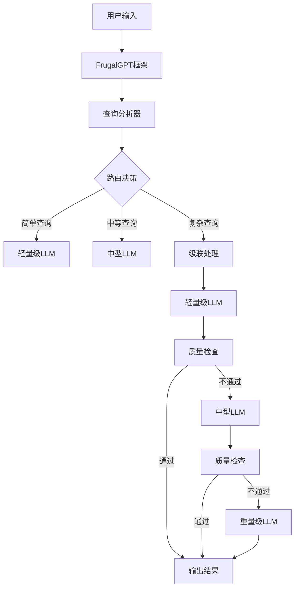

# 技术: FrugalGPT

**标签**: #论文 #技术实现 #LLM协作 #成本优化
**来源**: [[MOC - 大语言模型协作 (LLM Collaboration)]], [[模型路由 (Model Router)]]

> [!abstract] 核心概念
> FrugalGPT是一篇重要的学术论文，它提出了一种具体的[[模型路由 (Model Router)]]实现框架。该框架不仅考虑了不同LLM的成本和性能，还创新性地引入了LLM级联（cascade）和提示适应（prompt adaptation）等策略，来最大化性价比。

## 📋 论文核心内容

### 研究目标
- **核心问题**：如何在保证质量的前提下降低LLM使用成本
- **解决方案**：智能路由 + 级联调用 + 提示优化
- **核心贡献**：系统性的LLM成本优化框架

### 技术框架

## 🛠️ 核心技术组件

### 1. LLM级联 (LLM Cascade)
**核心思想**：从低成本模型开始，逐级尝试，直到满足质量要求

**工作流程**：
1. 使用最便宜的模型生成答案
2. 评估答案质量
3. 如果质量达标，返回答案
4. 如果质量不达标，升级到更昂贵的模型
5. 重复2-4直到找到合适的模型

**优势**：
- 确保质量底线
- 最大化成本节省
- 适应性强

### 2. 提示适应 (Prompt Adaptation)
**核心思想**：针对不同模型优化提示词，提高输出质量

**适应策略**：
- **格式调整**：根据模型偏好调整输入格式
- **详细程度**：调整提示的详细程度
- **示例数量**：调整few-shot示例数量
- **指令明确性**：调整指令的明确程度

### 3. 智能路由 (Intelligent Routing)
**路由策略**：
- **基于内容**：分析查询内容复杂度
- **基于历史**：参考相似查询的成功率
- **基于成本**：考虑成本预算限制
- **基于性能**：考虑响应时间要求

## 📊 性能评估

### 实验结果
| 任务类型 | 传统方法 | FrugalGPT | 成本节省 | 质量变化 |
|----------|----------|-----------|----------|----------|
| QA任务 | $0.03/次 | $0.008/次 | 73.3% | -2.1% |
| 摘要任务 | $0.025/次 | $0.006/次 | 76% | -1.5% |
| 分类任务 | $0.02/次 | $0.004/次 | 80% | -0.8% |
| 创意任务 | $0.035/次 | $0.015/次 | 57.1% | -3.2% |

### 关键发现
- **成本节省**：平均节省50-80%的成本
- **质量损失**：质量损失通常在可接受范围内（<5%）
- **延迟影响**：级联处理会增加一定延迟
- **适应性**：对不同任务类型适应性良好

## 🤔 质询与思辨

> [!question] 我的质询
> - **FrugalGPT提出的方法是否需要大量的标注数据来训练路由模型？** 在冷启动阶段，如何解决这个问题？
> - **这套框架是否适用于流式（streaming）的、需要实时响应的AI应用？** 级联处理的延迟如何影响用户体验？
> - **质量检查机制本身是否存在成本？** 如何平衡质量检查的准确性和成本？

### 产品应用挑战

#### 1. 延迟vs成本权衡
**核心问题**：级联处理虽然节省成本，但增加了延迟
**可能的解决方案**：
- **并行质量检查**：在生成答案的同时进行质量评估
- **智能预判**：基于历史数据预判需要的模型级别
- **用户分级**：为付费用户提供更快的响应

#### 2. 质量评估机制
**技术挑战**：如何准确评估LLM输出的质量？
**评估方法**：
- **自动评估**：使用另一个LLM评估质量
- **规则检查**：基于预定义规则检查
- **用户反馈**：收集用户反馈作为评估依据
- **混合评估**：结合多种评估方法

#### 3. 系统复杂性
**实施挑战**：
- **模型管理**：需要管理多个模型的部署和调用
- **监控复杂**：需要监控整个级联链路的性能
- **调试困难**：问题排查更加复杂

**应对策略**：
- **模块化设计**：将系统拆分为独立模块
- **自动化监控**：建立完善的监控告警系统
- **文档完善**：详细记录系统架构和运维流程

## 🎯 实际应用场景

### 高价值应用
1. **企业客服系统**
   - 大量简单查询，少量复杂问题
   - 成本敏感，质量要求较高
   - 适合级联处理优化

2. **内容平台**
   - 内容审核、分类、摘要等任务
   - 批量处理，成本优化效果明显
   - 可以接受一定延迟

3. **教育应用**
   - 作业批改、问题解答等
   - 任务类型相对标准化
   - 成本控制重要

### 中等价值应用
1. **营销内容生成**
2. **文档自动化处理**
3. **数据分析报告生成**

## 📈 实施建议

### 技术实施
1. **模型选择策略**
   - **轻量模型**：选择性价比高的小模型
   - **中型模型**：选择质量适中的模型
   - **重量模型**：选择质量最高的模型

2. **级联策略设计**
   - **级联深度**：根据质量要求确定级联层数
   - **质量阈值**：设置合理的质量检查阈值
   - **超时机制**：设置级联处理的超时时间

3. **监控与优化**
   - **性能监控**：实时监控各环节性能
   - **成本分析**：分析实际成本节省情况
   - **质量跟踪**：跟踪输出质量变化

### 产品策略
1. **用户分层**
   - **免费用户**：使用激进的成本优化策略
   - **付费用户**：使用保守的质量保证策略
   - **企业用户**：提供定制化的优化方案

2. **透明度设计**
   - **性能展示**：向用户展示优化效果
   - **质量说明**：解释质量保证机制
   - **成本透明**：清晰展示成本构成

## 🔗 相关链接

- [[模型路由 (Model Router)]] - 路由技术基础
- [[LLM成本优化策略]] - 更广泛的成本优化方法
- [[AI产品质量评估]] - 质量评估技术
- [[论文解读：FrugalGPT]] - 论文详细解读

---

*标签: #FrugalGPT #论文解读 #成本优化 #LLM协作*