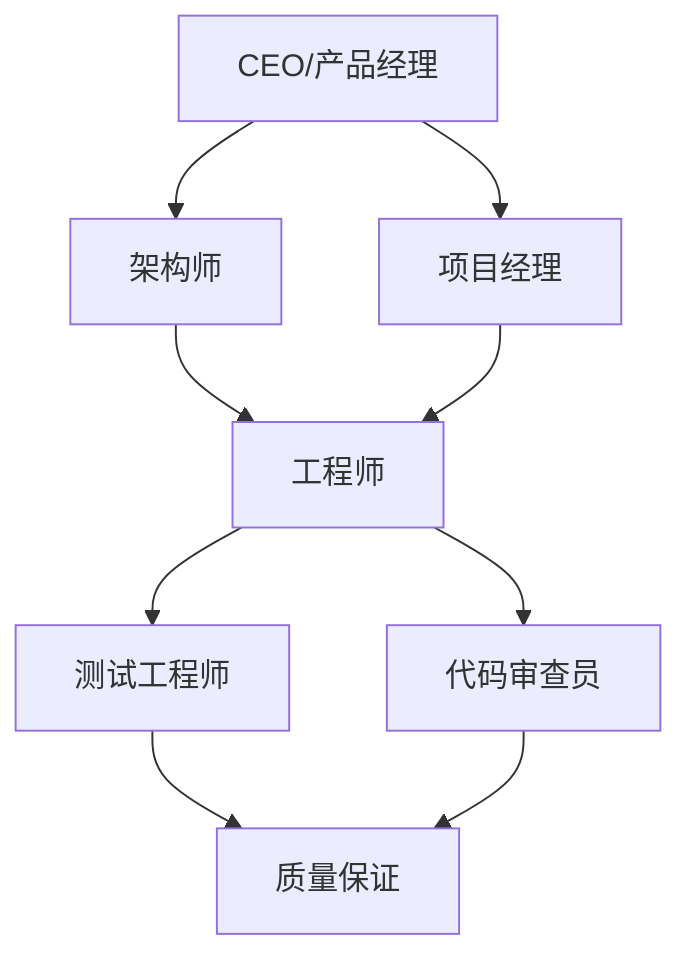
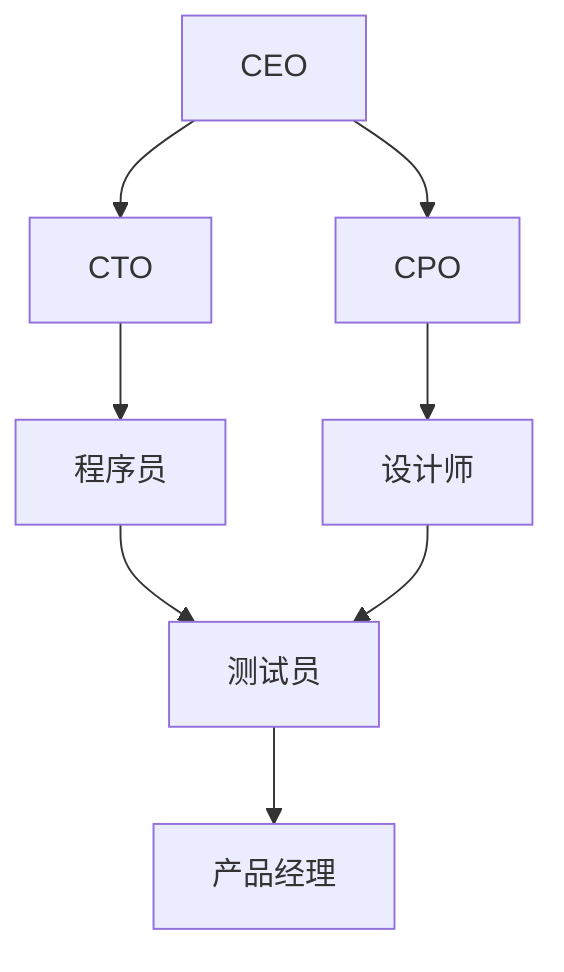

# 开源框架: MetaGPT与ChatDev

**标签**: #工具/开源 #Multi-Agent #LLM协作 #实践框架
**来源**: [[MOC - 大语言模型协作 (LLM Collaboration)]]

> [!abstract] 核心概念
> MetaGPT和ChatDev是两个著名的开源项目，它们提供了一个框架，让用户可以体验和实践[[多智能体系统 (Multi-Agent System)]]。这些框架内置了多种预设的AI角色（如产品经理、工程师、测试等），用户只需下达一个高层次的指令，这个AI团队就会自动进行任务分解、代码编写、测试和文档生成。

## 🏗️ 框架对比分析

### MetaGPT
#### 核心特点
- **企业级定位**：专注于复杂的软件开发任务
- **标准化流程**：模拟真实软件开发公司的组织架构
- **角色专业化**：每个角色都有明确的职责和专业技能
- **高质量输出**：强调生成代码的质量和可维护性

#### 角色设置


#### 工作流程
1. **需求分析**：产品经理分析用户需求
2. **系统设计**：架构师设计系统架构
3. **任务分解**：项目经理分解开发任务
4. **代码实现**：工程师编写具体代码
5. **测试验证**：测试工程师进行功能测试
6. **质量审查**：代码审查员检查代码质量
7. **文档生成**：自动生成技术文档

### ChatDev
#### 核心特点
- **轻量级设计**：简单易用，快速上手
- **高度可定制**：用户可以自定义角色和流程
- **教育导向**：适合学习和研究Multi-Agent系统
- **快速原型**：适合快速验证产品想法

#### 角色设置


#### 工作流程
1. **创意产生**：CEO提出产品创意
2. **技术评估**：CTO评估技术可行性
3. **需求定义**：CPO定义具体需求
4. **设计实现**：设计师进行UI/UX设计
5. **编码实现**：程序员编写功能代码
6. **测试验证**：测试员进行功能测试
7. **产品整合**：产品经理整合最终产品

## 🛠️ 技术实现

### 1. 系统架构
#### 通信机制
- **消息传递**：基于消息队列的Agent间通信
- **共享状态**：共享内存存储全局状态
- **事件驱动**：基于事件的异步通信

#### 角色实现
```python
class SoftwareEngineer(Agent):
    def __init__(self, name, skills):
        super().__init__(name)
        self.skills = skills
        self.role = "软件工程师"
        self.goals = ["编写高质量代码", "解决技术问题"]
    
    def generate_code(self, requirements):
        prompt = f"作为软件工程师，根据以下需求编写代码：{requirements}"
        return self.llm.generate(prompt)
```

### 2. 任务调度
#### 任务分解算法
```python
def task_decomposition(requirement, team):
    tasks = []
    
    # 产品经理分解需求
    pm_tasks = product_manager.decompose(requirement)
    
    # 架构师设计技术方案
    arch_tasks = architect.design(pm_tasks)
    
    # 工程师分解实现任务
    dev_tasks = engineer.decompose(arch_tasks)
    
    return tasks
```

#### 依赖管理
- **任务依赖图**：构建任务间的依赖关系
- **并行调度**：识别可并行执行的任务
- **资源分配**：根据Agent能力分配任务

### 3. 质量控制
#### 代码质量检查
- **静态分析**：使用静态代码分析工具
- **动态测试**：自动化单元测试和集成测试
- **代码审查**：Agent间的代码审查

#### 文档生成
- **API文档**：自动生成API文档
- **用户手册**：生成用户使用手册
- **技术文档**：生成技术架构文档

## 📊 性能评估

### 功能对比
| 特性 | MetaGPT | ChatDev |
|------|---------|---------|
| **复杂度** | 高 | 中等 |
| **学习成本** | 高 | 低 |
| **输出质量** | 高 | 中等 |
| **定制化** | 中等 | 高 |
| **适用场景** | 企业级项目 | 教育研究、原型 |

### 实验结果
#### 项目完成情况
| 项目类型 | MetaGPT成功率 | ChatDev成功率 | 完成时间对比 |
|----------|---------------|---------------|--------------|
| 简单Web应用 | 95% | 90% | MetaGPT快20% |
| 数据分析工具 | 85% | 75% | MetaGPT快30% |
| 游戏开发 | 70% | 60% | 相当 |
| 移动应用 | 65% | 50% | MetaGPT快40% |

#### 代码质量评估
| 质量指标 | MetaGPT | ChatDev | 人类开发者 |
|----------|---------|---------|------------|
| 功能完整性 | 85% | 75% | 95% |
| 代码可读性 | 80% | 70% | 90% |
| 性能优化 | 75% | 65% | 85% |
| 错误率 | 15% | 25% | 5% |

## 🤔 质询与思辨

> [!question] 我的质询
> - **这些框架目前在处理真实世界的、复杂的、充满模糊性的软件项目时，表现如何？** 它们最大的瓶颈在哪里？
> - **作为一个产品实习生，我能否利用这些框架来快速验证一些产品想法的原型（MVP）？** 用它们来生成代码的效率和质量，与我自己写相比如何？
> - **框架的"创造性"如何？** 它们能否产生真正创新的解决方案，还是只能重复训练数据中的模式？

### 产品应用挑战

#### 1. 实际应用限制
**技术瓶颈**：
- **上下文理解**：对复杂业务场景的理解有限
- **创造性缺乏**：难以产生真正创新的解决方案
- **调试困难**：AI生成代码的调试和修改困难
- **集成复杂**：与现有系统的集成复杂度高

**应对策略**：
- **人机协作**：AI生成 + 人工优化
- **渐进式应用**：从简单任务开始逐步扩展
- **专业领域适配**：针对特定领域进行优化

#### 2. 成本效益分析
**成本构成**：
- **API调用成本**：多次LLM调用的成本
- **时间成本**：AI生成和验证的时间
- **维护成本**：后续维护和修改的成本
- **学习成本**：团队学习和使用的成本

**效益评估**：
- **开发效率**：显著提高开发速度
- **原型验证**：快速验证产品想法
- **教育价值**：学习AI和软件开发的工具
- **创新启发**：启发新的开发思路

#### 3. 未来发展潜力
**技术趋势**：
- **模型能力提升**：随着LLM能力提升而提升
- **专业化发展**：针对特定领域的专业框架
- **工具链完善**：与现有开发工具的深度集成
- **标准化进程**：Multi-Agent系统的标准化

## 🎯 实际应用场景

### 高价值应用
1. **快速原型开发**
   - 产品想法的快速验证
   - MVP（最小可行产品）的快速构建
   - 适用于创业公司和产品团队

2. **教育工具**
   - 软件工程教育
   - AI技术学习和研究
   - 编程教学辅助

3. **自动化工具**
   - 重复性代码生成
   - 文档自动生成
   - 测试用例生成

### 中等价值应用
1. **小型项目开发**
2. **代码迁移和现代化**
3. **API和微服务开发**

## 📈 实施建议

### 技术实施
1. **框架选择**
   - **学习研究**：选择ChatDev，简单易上手
   - **实际项目**：选择MetaGPT，质量更高
   - **定制需求**：基于现有框架进行二次开发

2. **环境配置**
   - **模型选择**：选择合适的LLM模型
   - **API配置**：配置必要的API密钥
   - **依赖管理**：管理项目依赖关系

3. **质量保证**
   - **代码审查**：建立AI生成代码的审查流程
   - **测试验证**：完善自动化测试
   - **监控告警**：建立运行监控系统

### 产品策略
1. **应用定位**
   - **辅助工具**：作为开发辅助工具而非替代
   - **特定场景**：在适合的场景中应用
   - **价值明确**：明确为用户创造的价值

2. **用户教育**
   - **能力边界**：清晰说明框架的能力边界
   - **最佳实践**：提供使用最佳实践
   - **案例分享**：分享成功应用案例

## 🔗 相关链接

- [[多智能体系统 (Multi-Agent System)]] - Multi-Agent系统基础
- [[为LLM分配角色]] - 角色分配技术
- [[AI软件开发]] - AI在软件开发中的应用
- [[开源AI工具]] - 更多开源AI工具

---

*标签: #MetaGPT #ChatDev #开源框架 #Multi-Agent #软件开发*