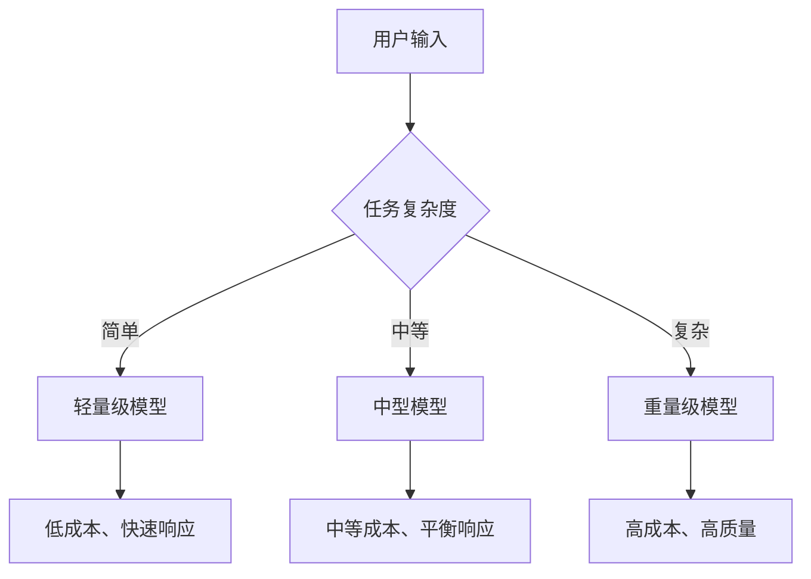

# 隐喻: 杀鸡焉用牛刀 - 模型路由

**标签**: #隐喻/AI #成本优化 #LLM协作
**来源**: [[MOC - 大语言模型协作 (LLM Collaboration)]]

> [!abstract] 核心概念
> 这个比喻生动地描述了[[模型路由 (Model Router)]]的核心思想：将简单的任务分配给成本较低、能力较弱的模型；只在处理复杂、关键的任务时，才动用昂贵、能力顶尖的模型。

## 🎯 隐喻解析

### 原始含义
- **杀鸡**：处理简单任务
- **牛刀**：强大的、昂贵的工具
- **核心思想**：工具能力要与任务复杂度匹配

### AI产品中的对应关系
| 原始隐喻 | AI产品中的含义 | 例子             |
| ---- | -------- | -------------- |
| 杀鸡   | 简单的AI任务  | 回答常见问题、文本分类    |
| 宰牛   | 复杂的AI任务  | 创意写作、复杂推理      |
| 小刀   | 轻量级模型    | GPT-3.5、开源小模型  |
| 牛刀   | 重量级模型    | GPT-4、Claude-3 |

## 💰 成本效益分析

### 任务复杂度分级

### 成本对比示例
假设：
- 轻量级模型：$0.001/1K tokens
- 中型模型：$0.005/1K tokens  
- 重量级模型：$0.03/1K tokens

| 任务类型 | 传统做法 | 智能路由 | 节省成本 |
|----------|----------|----------|----------|
| 简单问答 | 重量级模型 | 轻量级模型 | 96.7% |
| 内容分类 | 重量级模型 | 中型模型 | 83.3% |
| 创意写作 | 重量级模型 | 重量级模型 | 0% |

## 🤔 质询与思辨

> [!question] 我的质询
> - **"鸡"和"牛"的界限在哪里？** 对于一个产品，如何建立一个动态、准确的评估体系，来判断一个用户请求是"鸡"还是"牛"？
> - **如果错把"牛"当"鸡"杀了**（用低级模型处理了复杂问题），导致用户体验下降，这个损失的成本如何衡量？
> - **路由模型的训练成本** 是否会超过其节省的成本？如何计算ROI？

### 产品设计挑战

#### 1. 复杂度评估机制
**问题**：如何准确评估任务复杂度？
**可能的解决方案**：
- **关键词匹配**：预定义复杂任务的关键词
- **历史数据分析**：基于历史任务结果预测复杂度
- **双层评估**：先用轻量模型快速评估，再决定路由

#### 2. 用户体验管理
**问题**：用户如何感知路由决策？
**设计策略**：
- **透明化**：告知用户正在使用优化的AI服务
- **渐进式展示**：先快速响应，再提供深度分析选项
- **用户控制**：允许用户手动选择模型级别

#### 3. 错误路由的后果
**潜在风险**：
- **质量问题**：简单模型无法处理复杂任务
- **时间损失**：需要重新调用更强大的模型
- **用户信任**：频繁的错误路由会降低用户信任

## 🎯 实际应用场景

### 适用场景
1. **客服系统**
   - 简单查询 → 路由到FAQ匹配
   - 复杂问题 → 路由到高级AI客服

2. **内容平台**
   - 内容分类 → 路由到轻量级模型
   - 内容生成 → 路由到创意模型

3. **教育应用**
   - 知识查询 → 路由到知识库
   - 个性化辅导 → 路由到教学专家模型

### 不适用场景
- **实时性要求极高**：路由判断可能增加延迟
- **一致性要求严格**：不同模型的输出风格可能不一致
- **简单应用**：任务类型单一，无需路由

## 📊 实施建议

### 技术实施
1. **建立任务分类体系**
   - 定义清晰的任务复杂度标准
   - 收集标注数据用于训练路由模型

2. **路由模型开发**
   - 可以是传统的分类器
   - 也可以是小型的LLM
   - 需要考虑推理延迟

3. **监控和优化**
   - 实时监控路由准确性
   - 收集用户反馈
   - 动态调整路由策略

### 产品策略
1. **渐进式部署**
   - 先在非核心功能测试
   - 逐步扩展到核心功能

2. **A/B测试**
   - 对比路由vs非路由的用户体验
   - 量化成本节省和质量影响

3. **用户教育**
   - 解释智能路由的价值
   - 提供透明的性能指标

## 🔗 相关链接

- [[模型路由 (Model Router)]] - 技术实现细节
- [[FrugalGPT]] - 具体的路由实现框架
- [[AI产品成本优化]] - 更广泛的成本优化策略

---

*标签: #产品隐喻 #成本优化 #LLM路由 #AI产品设计*