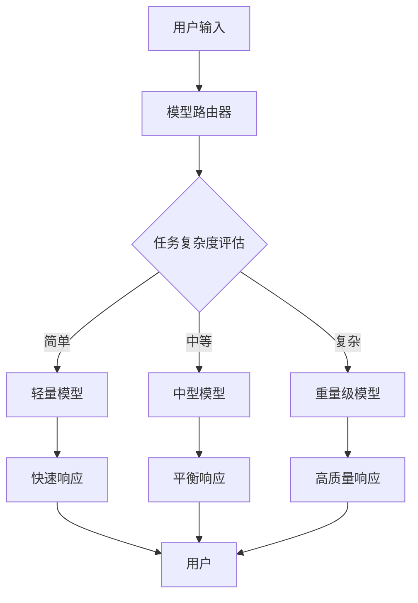

# 概念: 模型路由 (Model Router)

**标签**: #技术概念/LLM #成本优化 #LLM协作 #核心技术
**来源**: [[MOC - 大语言模型协作 (LLM Collaboration)]]

> [!abstract] 核心概念
> 训练一个额外的模型（可以是或不是LLM），它的唯一工作是判断一个新任务应该交给哪个下游LLM来处理，以实现成本和性能的最佳平衡。

## 🎯 核心原理

### 工作流程


### 路由决策因素
| 决策因素      | 评估方法          | 权重  |
| --------- | ------------- | --- |
| **任务复杂度** | 基于关键词、长度、结构分析 | 高   |
| **性能要求**  | 响应时间、质量要求     | 中   |
| **成本预算**  | 用户付费等级、使用额度   | 中   |
| **历史数据**  | 相似任务的成功率      | 低   |

## 🛠️ 技术实现

### 1. 路由模型类型
#### 传统机器学习模型
- **特点**：快速、轻量、可解释性强
- **适用场景**：任务分类明确、数据量大
- **算法**：SVM、随机森林、神经网络分类器

#### 轻量级LLM
- **特点**：理解能力强、灵活性高
- **适用场景**：复杂任务、需要语义理解
- **模型选择**：DistilGPT、TinyLLaMA等

#### 规则引擎
- **特点**：确定性高、维护简单
- **适用场景**：规则明确的任务分类
- **实现**：关键词匹配、正则表达式

### 2. 路由策略
#### 单一路由
```
输入 → 路由器 → 单一最佳模型 → 输出
```

#### 级联路由
```
输入 → 轻量模型 → 质量检查 → 通过？ → 输出
                    ↓
                   否
                    ↓
                中型模型 → 质量检查 → 通过？ → 输出
                                    ↓
                                   否
                                    ↓
                                重量级模型 → 输出
```

#### 并行路由
```
输入 → 多个模型并行 → 质量评估 → 最佳选择 → 输出
```

### 3. 性能优化技术
#### 缓存机制
- **结果缓存**：缓存相似问题的路由结果
- **模型缓存**：保持模型热启动状态
- **预加载**：根据负载预测预加载模型

#### 动态调整
- **负载均衡**：根据模型负载调整路由
- **性能监控**：实时监控模型性能
- **A/B测试**：持续优化路由策略

## 📊 成本效益分析

### 成本构成
| 成本类型 | 说明 | 优化策略 |
|----------|------|----------|
| **路由成本** | 路由模型的计算和推理成本 | 使用轻量路由模型 |
| **模型成本** | 目标模型的API调用成本 | 智能路由减少高级模型调用 |
| **延迟成本** | 路由判断的时间成本 | 优化路由算法减少延迟 |
| **错误成本** | 路由错误的损失成本 | 提高路由准确性 |

### 效益分析
假设场景：客服系统日均10,000次查询

| 路由策略 | 平均成本/次 | 日总成本 | 质量评分 | 节省成本 |
|----------|-------------|----------|----------|----------|
| 全部使用GPT-4 | $0.03 | $300 | 9.5/10 | 基准线 |
| 智能路由 | $0.008 | $80 | 9.2/10 | 73.3% |
| 简单路由 | $0.005 | $50 | 8.5/10 | 83.3% |

## 🤔 质询与思辨 (Interrogation & Reflection)

> [!question] 我的质询
> - **路由模型本身的成本和延迟是多少？** 如果路由判断的时间过长，会不会抵消掉调用廉价模型省下的时间？
> - **如何定义"简单"和"复杂"？** 这个判断标准是固定的，还是可以动态学习的？对于我们`[[项目A：智能BI助手]]`，一个查询是"简单"（查库存）还是"复杂"（做趋势预测），路由模型能准确判断吗？
> - **路由失败的后果是什么？** 如果一个复杂问题被错误地路由给了简单模型，导致回答质量差，这个用户体验的损失如何衡量？

### 产品设计挑战

#### 1. 准确性vs成本平衡
**核心问题**：如何在保证准确性的前提下最大化成本节省？
**解决思路**：
- **质量监控**：实时监控路由结果质量
- **动态调整**：根据质量反馈调整路由策略
- **用户反馈**：收集用户对回答质量的评价
- **混合策略**：重要问题使用保守路由策略

#### 2. 用户体验管理
**设计挑战**：
- **透明度**：是否告诉用户使用了路由优化？
- **一致性**：不同模型的回答风格差异
- **错误处理**：路由错误的恢复机制

**解决方案**：
- **渐进式展示**：先快速响应，再提供深度分析
- **风格统一**：后处理统一不同模型的输出风格
- **升级机制**：允许用户请求更高级模型处理

#### 3. 技术实现复杂性
**实施挑战**：
- **训练数据**：需要标注大量任务复杂度数据
- **模型维护**：路由模型需要持续更新
- **系统集成**：与现有系统的集成复杂度

**应对策略**：
- **渐进式部署**：分阶段实施路由功能
- **自动化监控**：建立自动化监控和告警
- **A/B测试**：小规模测试验证效果

## 🎯 实际应用场景

### 适用场景
1. **客户服务系统**
   - 简单查询：FAQ、状态查询
   - 复杂问题：投诉处理、技术支持

2. **内容生成平台**
   - 简单生成：摘要、分类
   - 复杂生成：创意写作、专业内容

3. **教育应用**
   - 简单问答：知识点查询
   - 复杂辅导：个性化学习路径

4. **企业工具**
   - 简单任务：数据查询、报表生成
   - 复杂任务：战略分析、决策支持

### 不适用场景
- **实时性要求极高**：路由延迟影响用户体验
- **一致性要求严格**：需要完全一致的输出风格
- **任务类型单一**：无需路由的简单应用

## 📈 实施建议

### 技术实施
1. **数据收集与标注**
   - 收集历史任务数据
   - 标注任务复杂度和适合的模型
   - 建立评估标准

2. **模型开发与训练**
   - 选择合适的路由模型架构
   - 训练和验证路由模型
   - 优化模型性能

3. **系统集成与测试**
   - 集成到现有系统
   - 进行A/B测试
   - 监控实际效果

### 产品策略
1. **渐进式部署**
   - 先在非核心功能测试
   - 逐步扩展到核心功能
   - 持续优化策略

2. **用户教育**
   - 解释路由优化的价值
   - 提供透明的性能指标
   - 收集用户反馈

3. **商业考量**
   - 量化成本节省
   - 评估质量影响
   - 制定定价策略

## 🔗 相关链接

- [[FrugalGPT]] - 具体的路由实现框架
- [[杀鸡焉用牛刀 - 模型路由]] - 核心隐喻解释
- [[AI产品成本优化]] - 更广泛的成本优化策略
- [[模型性能评估]] - 模型选择和评估方法

---

*标签: #LLM路由 #成本优化 #技术实现 #产品设计*