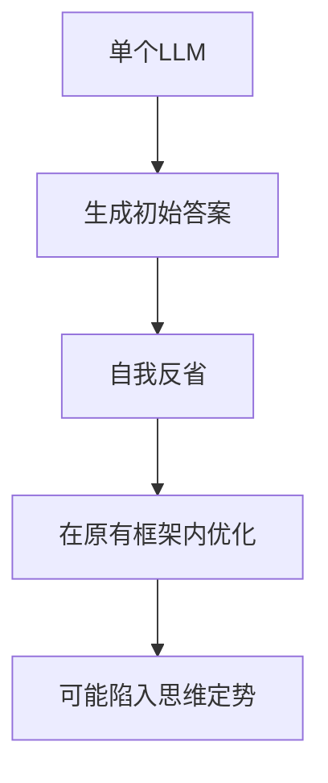
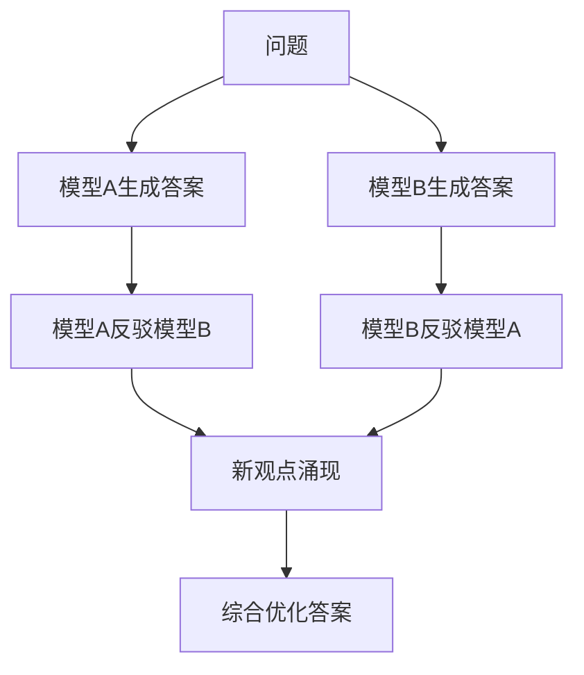

# 概念: 激发新能力 - 模型讨论与辩论

**标签**: #技术概念/LLM #创新 #LLM协作 #方法论
**来源**: [[MOC - 大语言模型协作 (LLM Collaboration)]]

> [!abstract] 核心概念
> 通过让多个LLM就同一个问题进行多轮对话或辩论（[[多模型讨论 (Multi-Model Debate)]]），可以激发出单个模型[[自我反省 (Self-Reflection)]]所无法达到的、更高质量和更具创新性的答案。

## 🧠 核心机制

### 单一模型的局限性


### 多模型辩论的优势


## 🎯 辩论模式分类

### 1. 对立辩论模式
**特点**：模型持有不同立场，互相质疑
**适用场景**：
- 需要多角度分析的问题
- 存在争议的议题
- 创意发散阶段

**例子**：
```
模型A：支持观点X，提供论据
模型B：反对观点X，提供反驳
模型A：回应反驳，强化论点
...
最终：综合双方观点，给出平衡结论
```

### 2. 互补辩论模式
**特点**：模型从不同专业角度补充
**适用场景**：
- 需要多专业知识的问题
- 跨领域分析
- 综合决策

**例子**：
```
技术专家模型：技术可行性分析
商业专家模型：商业价值评估
用户体验模型：用户影响分析
...
最终：综合多维度评估结果
```

### 3. 递进辩论模式
**特点**：模型在前一个模型基础上深化
**适用场景**：
- 需要深度思考的问题
- 分层次分析
- 逐步优化

## 📊 效果对比分析

| 指标 | 自我反省 | 多模型辩论 | 提升幅度 |
|------|----------|------------|----------|
| 回答质量 | 基准线 | +15-30% | 显著提升 |
| 创新性 | 基准线 | +25-40% | 大幅提升 |
| 全面性 | 基准线 | +20-35% | 显著提升 |
| 计算成本 | 1x | 3-5x | 显著增加 |
| 响应时间 | 1x | 3-5x | 显著增加 |

## 🤔 质询与思辨

> [!question] 我的质询
> - **"辩论"是否会陷入无意义的循环？** 如何设计机制（例如引入[[裁判模型 (Judge Model)]]）来确保辩论是收敛的，而不是发散的？
> - **对于AIGC产品，能否让用户参与到这个"辩论"过程中**，由用户来扮演裁判或引导者的角色？
> - **辩论的"深度"如何控制？** 是固定轮次，还是动态判断收敛？

### 产品设计挑战

#### 1. 收敛性控制
**问题**：如何确保辩论有效收敛？
**可能的解决方案**：
- **固定轮次**：预设最大辩论轮数
- **相似度检测**：检测观点是否开始重复
- **质量评估**：实时评估回答质量改进程度
- **裁判机制**：引入独立模型判断是否继续

#### 2. 用户参与设计
**可能的交互模式**：
- **观察者模式**：用户观看AI辩论过程
- **裁判模式**：用户作为最终裁判
- **参与者模式**：用户直接参与辩论
- **引导者模式**：用户引导辩论方向

#### 3. 成本效益平衡
**优化策略**：
- **选择性辩论**：只在复杂问题上启用
- **分层辩论**：先用轻量模型预筛选
- **并行处理**：同时进行多轮辩论
- **结果缓存**：相似问题复用辩论结果

## 🎯 实际应用场景

### 高价值应用
1. **战略决策支持**
   - 多模型从不同角度分析战略选择
   - 辩论帮助发现潜在风险和机会

2. **创意内容生成**
   - 不同风格的AI辩论激发创意
   - 产生更多元化的内容

3. **复杂问题解决**
   - 技术难题的多角度分析
   - 跨领域知识的整合

4. **教育和培训**
   - 模拟专家讨论
   - 提供多角度学习材料

### 中等价值应用
1. **产品功能设计**
   - 不同角色（用户、开发者、设计师）视角辩论
   - 平衡各方需求

2. **市场营销策略**
   - 不同营销策略的辩论
   - 多维度评估市场反应

## 📈 实施建议

### 技术实施
1. **辩论框架设计**
   - 定义清晰的辩论规则
   - 设计有效的Prompt模板
   - 建立质量评估机制

2. **模型选择策略**
   - 选择不同特点的模型参与辩论
   - 考虑专业性和多样性平衡
   - 优化模型组合

3. **结果整合机制**
   - 设计有效的结果整合算法
   - 确保最终答案的质量和一致性
   - 提供辩论过程的透明度

### 产品策略
1. **场景选择**
   - 优先在高价值场景实施
   - 避免在实时性要求高的场景使用
   - 考虑用户对复杂度的接受程度

2. **用户体验设计**
   - 设计直观的辩论过程展示
   - 提供辩论结果的解释
   - 允许用户控制辩论深度

3. **性能优化**
   - 实施缓存机制
   - 优化模型调用策略
   - 监控实际效果

## 🔗 相关链接

- [[多模型讨论 (Multi-Model Debate)]] - 具体实现技术
- [[裁判模型 (Judge Model)]] - 辩论控制机制
- [[刺激性Prompt：打破温良恭俭让]] - 辩论激发技巧
- [[AI产品质量提升]] - 更广泛的质量优化策略

---

*标签: #LLM协作 #创新方法 #产品设计 #质量优化*