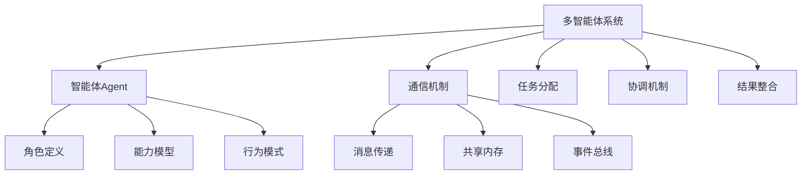

# 概念: 组建AI团队 - 多智能体系统 (Multi-Agent System)

**标签**: #技术概念/LLM #Multi-Agent #LLM协作 #系统架构
**来源**: [[MOC - 大语言模型协作 (LLM Collaboration)]]

> [!abstract] 核心概念
> [[多智能体系统 (Multi-Agent System)]]是指让多个独立的、具备特定角色和能力的LLM智能体（Agent）协同工作，像一个人类团队一样，共同完成一个复杂的、多阶段的任务。

## 🏗️ 系统架构

### 核心组成要素


### 智能体角色分类
| 角色类型    | 职责       | 所需能力      | 示例模型             |
| ------- | -------- | --------- | ---------------- |
| **决策者** | 制定策略、做决策 | 逻辑推理、战略思维 | GPT-4、Claude-3   |
| **执行者** | 具体任务执行   | 专业技能、效率   | 专用模型、微调模型        |
| **协调者** | 协调团队工作   | 沟通、组织     | 通用LLM + 协调Prompt |
| **评估者** | 质量检查、评估  | 分析能力、标准判断 | 专业评估模型           |
| **创新者** | 创意、创新思维  | 创造力、发散思维  | 创意优化模型           |

## 🔄 协作模式

### 1. 层级协作模式
```
项目经理 → 技术负责人 → 开发人员 → 测试人员
    ↓         ↓           ↓          ↓
   决策     协调        执行       验证
```

### 2. 网络协作模式
```
    产品经理
   ↗   ↑   ↖
设计师 ←→ 开发者
   ↖   ↓   ↙
    测试人员
```

### 3. 流水线协作模式
```
需求分析 → 架构设计 → 编码实现 → 测试验证 → 部署上线
    ↓         ↓         ↓         ↓         ↓
  分析Agent  设计Agent  开发Agent  测试Agent  运维Agent
```

## 🎯 关键技术组件

### 1. 角色定义与分配
**技术实现**：
- **静态角色**：预定义的角色和能力
- **动态角色**：根据任务需求动态分配
- **角色继承**：基于基础角色的专业扩展

### 2. 通信机制
**通信方式**：
- **直接消息**：Agent间直接通信
- **广播机制**：向所有Agent广播消息
- **订阅机制**：基于主题的消息分发
- **共享状态**：共享内存或数据库

### 3. 任务分配与调度
**分配策略**：
- **能力匹配**：根据Agent能力分配任务
- **负载均衡**：考虑Agent工作负载
- **优先级调度**：基于任务优先级
- **动态重分配**：根据执行情况调整

### 4. 冲突解决机制
**冲突类型**：
- **资源冲突**：多个Agent争用资源
- **目标冲突**：Agent目标不一致
- **观点冲突**：Agent对问题看法不同

**解决策略**：
- **协商机制**：通过协商达成一致
- **仲裁机制**：由第三方Agent仲裁
- **投票机制**：通过投票决定
- **优化机制**：寻找最优解决方案

## 🤔 质询与思辨

> [!question] 我的质询
> - **团队协作的"沟通成本"在AI世界里是什么？** 是API调用次数，还是token的消耗？如何量化和优化这个成本？
> - **当AI团队成员之间产生逻辑冲突时**（比如"设计师"想要华丽的UI，"工程师"认为实现成本高），最终的决策权归谁？这个仲裁机制如何设计？
> - **智能体的"专业化" vs "通用化"** 如何平衡？是培养专业化的Agent，还是使用通用Agent通过角色扮演？

### 产品设计挑战

#### 1. 成本控制挑战
**成本构成**：
- **计算成本**：多个Agent并行运行的算力消耗
- **通信成本**：Agent间通信的token消耗
- **协调成本**：任务分配和协调的开销
- **存储成本**：中间结果和状态存储

**优化策略**：
- **智能调度**：避免不必要的Agent激活
- **结果缓存**：复用相似任务的结果
- **分层协作**：简单任务使用少量Agent
- **并行处理**：最大化资源利用率

#### 2. 决策机制设计
**关键问题**：
- **最终决策权**：谁来做最终决策？
- **决策透明度**：如何向用户解释决策过程？
- **决策质量**：如何保证决策质量？

**可能的解决方案**：
- **分级决策**：不同级别决策由不同Agent负责
- **共识机制**：通过协商达成共识
- **用户参与**：让用户参与关键决策
- **混合决策**：AI建议 + 人类最终决策

#### 3. 用户体验设计
**设计挑战**：
- **复杂度管理**：如何向用户展示复杂的协作过程
- **预期管理**：用户对多Agent系统的合理预期
- **控制度**：用户对Agent行为的控制程度

**设计策略**：
- **透明化展示**：可视化Agent协作过程
- **简化交互**：提供简洁的用户接口
- **渐进式披露**：根据需要展示详细信息
- **用户控制**：允许用户调整Agent行为

## 🎯 实际应用场景

### 高价值应用
1. **软件开发自动化**
   - **Agent组成**：产品经理、架构师、开发者、测试、运维
   - **价值**：全自动软件开发生命周期
   - **挑战**：复杂度管理、质量保证

2. **内容创作平台**
   - **Agent组成**：策划、编剧、设计师、编辑、审核
   - **价值**：高质量内容批量生产
   - **挑战**：创意质量控制、风格一致性

3. **客户服务系统**
   - **Agent组成**：客服代表、技术专家、投诉处理、满意度调查
   - **价值**：全方位客户服务体验
   - **挑战**：情感理解、个性化服务

4. **研发辅助系统**
   - **Agent组成**：文献研究员、实验设计师、数据分析、论文撰写
   - **价值**：加速科研进程
   - **挑战**：专业知识深度、创新性保证

### 中等价值应用
1. **营销活动策划**
2. **教育培训系统**
3. **金融服务咨询**
4. **医疗诊断辅助**

## 📈 实施建议

### 技术实施
1. **架构设计原则**
   - **模块化设计**：每个Agent独立模块
   - **松耦合**：减少Agent间依赖
   - **可扩展性**：易于添加新Agent
   - **容错性**：单个Agent失败不影响整体

2. **开发方法论**
   - **迭代开发**：从简单到复杂逐步构建
   - **测试驱动**：充分测试每个Agent
   - **监控告警**：实时监控系统状态
   - **持续优化**：基于运行数据优化

3. **性能优化**
   - **并行处理**：最大化并行度
   - **缓存策略**：减少重复计算
   - **资源调度**：优化资源分配
   - **负载均衡**：平衡Agent负载

### 产品策略
1. **市场定位**
   - **企业市场**：复杂的业务流程自动化
   - **开发者市场**：开发工具和平台
   - **消费者市场**：智能助手和服务

2. **商业模式**
   - **平台模式**：提供多Agent平台
   - **解决方案模式**：提供完整解决方案
   - **API服务模式**：提供Agent能力API

3. **竞争策略**
   - **技术领先**：保持技术优势
   - **生态建设**：建设开发者生态
   - **用户体验**：提供最佳用户体验

## 🔗 相关链接

- [[为LLM分配角色]] - 角色分配技术
- [[动态LLM智能体网络]] - 智能体优化机制
- [[MetaGPT与ChatDev]] - 开源实现框架
- [[AI团队管理]] - 更广泛的团队管理策略

---

*标签: #Multi-Agent #LLM协作 #系统架构 #产品设计*