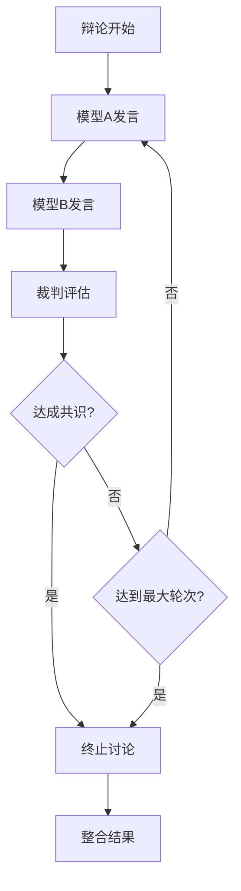

# 机制: 裁判模型 (Judge Model)

**标签**: #技术概念/LLM #Multi-Agent #LLM协作 #质量控制
**来源**: [[MOC - 大语言模型协作 (LLM Collaboration)]]

> [!abstract] 核心概念
> 在[[多模型讨论 (Multi-Model Debate)]]中，引入一个独立的LLM来扮演"裁判"的角色。它的任务是：
> 1.  判断讨论是否已达成共识。
> 2.  控制讨论的流程（继续或终止）。
> 3.  在讨论结束后，负责整合各方观点，生成最终的、更高质量的结论。

## 🎯 裁判模型的核心职责

### 1. 流程控制 (Flow Control)


### 2. 质量评估 (Quality Assessment)
**评估维度**：
- **相关性**：回答是否切题
- **准确性**：信息是否准确
- **完整性**：回答是否全面
- **一致性**：逻辑是否一致
- **创新性**：是否有新观点

### 3. 结果整合 (Result Integration)
**整合策略**：
- **共识提取**：识别各方共识点
- **分歧处理**：平衡不同观点
- **优化补充**：添加缺失的重要信息
- **格式化输出**：生成结构化的最终答案

## 🛠️ 技术实现

### 1. 裁判模型架构
#### 专用裁判模型
- **特点**：专门训练用于评估和整合
- **优势**：评估准确性高
- **劣势**：开发和维护成本高

#### 通用LLM + 特殊Prompt
- **特点**：使用通用LLM配合评估Prompt
- **优势**：实施简单、灵活性高
- **劣势**：评估质量依赖Prompt设计

#### 混合评估机制
- **特点**：结合规则引擎和LLM评估
- **优势**：结合了确定性和灵活性
- **劣势**：系统复杂度高

### 2. 评估算法设计
#### 基于规则的评估
```python
def rule_based_evaluation(responses):
    scores = []
    for response in responses:
        score = 0
        # 相关性检查
        if contains_keywords(response, query_keywords):
            score += 0.3
        # 长度检查
        if len(response) > MIN_LENGTH:
            score += 0.2
        # 重复性检查
        if not has_repetition(response):
            score += 0.2
        scores.append(score)
    return scores
```

#### 基于LLM的评估
```python
def llm_based_evaluation(query, responses):
    prompt = f"""
    评估以下回答的质量：
    问题：{query}
    回答1：{responses[0]}
    回答2：{responses[1]}
    
    请从相关性、准确性、完整性三个维度打分（1-10分），
    并判断是否需要继续讨论。
    """
    return judge_model.generate(prompt)
```

### 3. 停止条件设计
#### 硬性停止条件
- **最大轮次**：达到预设的讨论轮次上限
- **时间限制**：超过最大处理时间
- **成本限制**：超过token使用预算

#### 软性停止条件
- **共识达成**：各方观点趋于一致
- **质量达标**：回答质量达到预设阈值
- ** diminishing_returns**：继续讨论质量提升不明显

## 📊 性能评估

### 评估指标
| 指标 | 说明 | 目标值 |
|------|------|--------|
| **评估准确性** | 裁判判断的准确率 | >85% |
| **收敛效率** | 达成共识的平均轮次 | <5轮 |
| **结果质量** | 最终答案的质量评分 | >8/10 |
| **计算成本** | 裁判模型的计算开销 | <总成本的20% |

### 实验结果对比
| 裁判策略 | 讨论轮次 | 最终质量 | 计算成本 | 用户满意度 |
|----------|----------|----------|----------|------------|
| 无裁判 | 8.2 | 7.8 | 基准线 | 75% |
| 规则裁判 | 4.5 | 8.1 | +15% | 82% |
| LLM裁判 | 3.8 | 8.9 | +25% | 89% |
| 混合裁判 | 4.1 | 8.7 | +20% | 87% |

## 🤔 质询与思辨

> [!question] 我的质询
> - **裁判的公正性如何保证？** 如果裁判模型本身有偏见（Bias），会不会导致它总是偏爱某一种风格的答案？
> - **"共识"的定义是什么？** 是指语义完全一致，还是指逻辑上不再冲突？这个判断的粒度如何控制？
> - **对于AIGC产品，谁来扮演"裁判"？** 在一个AI辅助写作工具中，最终的"裁判"是用户本人。那么，我们能否设计一个"用户偏好模型"来模拟用户的裁判行为？

### 产品设计挑战

#### 1. 公正性保证
**核心问题**：如何避免裁判模型的偏见？
**可能的解决方案**：
- **多样化训练**：使用多样化的训练数据
- **偏见检测**：实时检测和纠正偏见
- **多裁判机制**：使用多个裁判模型相互监督
- **用户反馈**：收集用户反馈来调整裁判行为

#### 2. 共识定义
**技术挑战**：如何准确定义和检测共识？
**共识类型**：
- **语义共识**：表达方式不同但意思一致
- **逻辑共识**：在关键逻辑上达成一致
- **价值共识**：在价值判断上达成一致

**检测方法**：
- **文本相似度**：计算回答间的语义相似度
- **关键观点匹配**：检查关键观点的一致性
- **逻辑一致性**：验证逻辑推理的一致性

#### 3. 用户角色设计
**产品创新**：让用户参与裁判过程
**交互模式**：
- **最终裁判**：用户作为最终决策者
- **偏好学习**：系统学习用户的裁判偏好
- **权重调整**：用户可以调整不同模型的权重
- **直接干预**：用户可以直接终止或继续讨论

## 🎯 实际应用场景

### 高价值应用
1. **决策支持系统**
   - 多个专家模型提供不同建议
   - 裁判模型整合建议并提供最终决策支持
   - 适用于金融、医疗等高风险领域

2. **创意内容生成**
   - 多个创意模型生成不同风格的内容
   - 裁判模型评估创意质量并整合最佳元素
   - 适用于广告、设计、写作等领域

3. **教育辅导系统**
   - 多个教学模型提供不同解释
   - 裁判模型选择最适合学生的解释方式
   - 个性化教育的重要技术

### 中等价值应用
1. **客服质量监控**
2. **代码审查自动化**
3. **市场分析报告生成**

## 📈 实施建议

### 技术实施
1. **裁判模型选择**
   - **质量优先**：选择高质量的模型作为裁判
   - **专业匹配**：根据领域选择专业化的裁判模型
   - **成本控制**：在保证质量的前提下控制成本

2. **评估机制设计**
   - **多维度评估**：从多个维度评估回答质量
   - **动态权重**：根据任务类型调整评估维度权重
   - **反馈学习**：基于反馈数据持续优化评估机制

3. **系统集成**
   - **模块化设计**：将裁判功能设计为独立模块
   - **接口标准化**：提供标准化的裁判接口
   - **监控告警**：建立完善的监控和告警机制

### 产品策略
1. **透明度设计**
   - **过程可视化**：向用户展示裁判过程
   - **结果解释**：解释裁判决策的依据
   - **信心度展示**：展示裁判结果的信心度

2. **用户控制**
   - **参数调整**：允许用户调整裁判参数
   - **模式选择**：提供不同的裁判模式选择
   - **反馈机制**：收集用户对裁判结果的反馈

## 🔗 相关链接

- [[多模型讨论 (Multi-Model Debate)]] - 辩论模式基础
- [[刺激性Prompt：打破温良恭俭让]] - 辩论激发技巧
- [[AI产品质量评估]] - 质量评估技术
- [[用户偏好建模]] - 用户偏好学习技术

---

*标签: #裁判模型 #Multi-Agent #质量控制 #LLM协作*