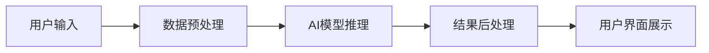

# [[AI产品应用分析模板]]

## 🎯 应用场景概述
> [!info] 场景描述
> 简要描述这个AI产品应用场景的核心价值主张

## 📊 市场需求分析
### 用户痛点
- **痛点1**: 具体描述用户面临的问题
- **痛点2**: 传统解决方案的不足
- **痛点3**: AI能提供的独特价值

### 目标用户画像
- **主要用户**: [[用户群体1]] - 特征和需求
- **次要用户**: [[用户群体2]] - 特征和需求

## 🛠️ 技术实现方案
### 核心技术栈
- [[技术1]]: 作用和重要性
- [[技术2]]: 作用和重要性
- [[技术3]]: 作用和重要性

### 技术架构

## 💡 产品功能设计
### 核心功能
1. **功能1**: [[功能描述]] - 解决什么问题
2. **功能2**: [[功能描述]] - 解决什么问题
3. **功能3**: [[功能描述]] - 解决什么问题

### 用户体验设计
- **交互流程**: 用户如何使用产品
- **反馈机制**: 如何向用户展示AI结果
- **容错设计**: AI出错时的处理方案

## 📈 商业模式分析
### 价值主张
- **效率提升**: 具体提升指标
- **成本降低**: 具体降低幅度
- **体验改善**: 具体改善方面

### 盈利模式
- **模式1**: [[收费方式]] - 定价策略
- **模式2**: [[收费方式]] - 定价策略

## ⚖️ 技术可行性评估
### 技术成熟度
- **技术1**: 成熟度评级 (1-5) - 依据
- **技术2**: 成熟度评级 (1-5) - 依据
- **技术3**: 成熟度评级 (1-5) - 依据

### 实现难度
- **开发难度**: 人力、时间投入评估
- **维护难度**: 持续运营成本评估
- **扩展难度**: 未来功能扩展评估

## 🎯 产品路线图
### MVP阶段 (1-3个月)
- [ ] 核心功能实现
- [ ] 技术验证
- [ ] 用户测试

### 成长阶段 (3-6个月)
- [ ] 功能完善
- [ ] 性能优化
- [ ] 用户增长

### 成熟阶段 (6-12个月)
- [ ] 规模化扩展
- [ ] 商业化变现
- [ ] 生态建设

## 🚨 风险评估与应对
### 技术风险
- **风险1**: [[具体风险]] - 应对策略
- **风险2**: [[具体风险]] - 应对策略

### 市场风险
- **风险1**: [[具体风险]] - 应对策略
- **风险2**: [[具体风险]] - 应对策略

### 运营风险
- **风险1**: [[具体风险]] - 应对策略
- **风险2**: [[具体风险]] - 应对策略

## 📊 成功指标
### 技术指标
- **准确率**: 目标值 > 90%
- **响应时间**: 目标值 < 1s
- **可用性**: 目标值 > 99.9%

### 业务指标
- **用户增长**: 目标值 月增长20%
- **用户留存**: 目标值 次日留存 > 60%
- **收入增长**: 目标值 季度增长30%

## 🔗 相关链接
- [[相关技术概念]]
- [[竞争对手分析]]
- [[市场调研报告]]
- [[技术团队资源]]

## 💡 创新点
### 技术创新
- **创新1**: [[具体创新点]] - 价值说明
- **创新2**: [[具体创新点]] - 价值说明

### 产品创新
- **创新1**: [[具体创新点]] - 价值说明
- **创新2**: [[具体创新点]] - 价值说明

## 🤔 思考问题
> [!question] 战略思考
> - 这个应用的长期竞争力在哪里？
> - 如何构建技术壁垒？
- - 如何应对快速变化的技术环境？
> - 团队需要具备哪些核心能力？

## 📝 行动计划
> [!todo] 关键行动项
> - [ ] 完成技术可行性验证
> - [ ] 制定详细产品计划
> - [ ] 组建跨职能团队
> - [ ] 设计MVP原型
> - [ ] 制定推广策略

---

*标签: #AI产品 #应用分析 #产品规划 #商业模式 #技术实现*