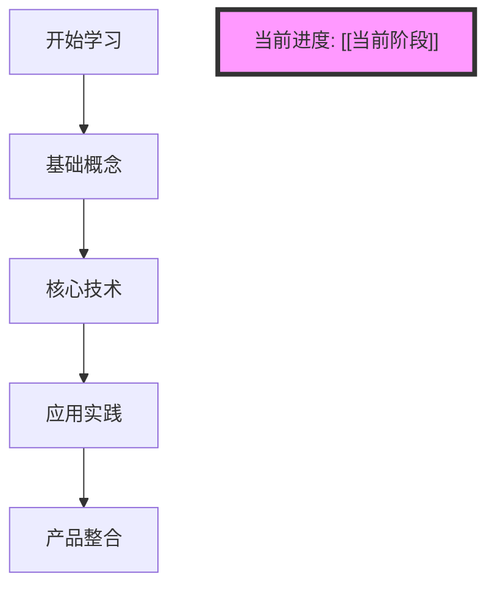

# [[学习进度追踪模板]]

## 📋 学习概览
- **学习主题**: [[李宏毅人工智能导论]]
- **开始日期**: <% tp.date.now("YYYY-MM-DD") %>
- **当前阶段**: [[当前学习阶段]]
- **整体进度**: [[进度百分比]]%

## 🎯 本周学习目标
### 主要目标
- [ ] [[目标1]] - 预计完成时间
- [ ] [[目标2]] - 预计完成时间
- [ ] [[目标3]] - 预计完成时间

### 学习计划
| 日期 | 学习内容 | 预计时间 | 完成状态 |
|------|----------|----------|----------|
| [[日期1]] | [[学习内容]] | [[时长]] | ⏳ |
| [[日期2]] | [[学习内容]] | [[时长]] | ⏳ |
| [[日期3]] | [[学习内容]] | [[时长]] | ⏳ |

## 📚 已完成内容
### 概念学习
- [x] [[概念1]] - 完成日期
- [x] [[概念2]] - 完成日期
- [x] [[概念3]] - 完成日期

### 技术实践
- [x] [[实践项目1]] - 完成日期
- [x] [[实践项目2]] - 完成日期

### 应用分析
- [x] [[应用场景1]] - 完成日期
- [x] [[应用场景2]] - 完成日期

## 🤔 学习难点与解决方案
### 当前难点
- **难点1**: [[具体难点]]
  - **解决方案**: [[解决方案]]
  - **进展**: [[解决进展]]

- **难点2**: [[具体难点]]
  - **解决方案**: [[解决方案]]
  - **进展**: [[解决进展]]

## 💡 学习洞察
### 技术理解
> [!idea] 重要洞察
> 记录学习过程中的重要技术理解

### 产品思考
> [!idea] 产品洞察
> 记录将技术与产品结合的思考

### 职业发展
> [!idea] 职业洞察
> 记录对AI产品经理职业发展的思考

## 🔗 知识关联
### 新建立的概念链接
- [[新概念1]] → [[相关概念1]]
- [[新概念2]] → [[相关概念2]]
- [[新概念3]] → [[相关概念3]]

### 与现有知识体系的连接
- 与[[AI产品经理思维模型MOC]]的连接
- 与[[技术理解能力提升]]的连接
- 与[[产品经理核心能力MOC]]的连接

## 📊 学习效果评估
### 知识掌握程度
| 知识领域 | 掌握程度 | 评估标准 |
|----------|----------|----------|
| [[领域1]] | [[程度]] | [[标准]] |
| [[领域2]] | [[程度]] | [[标准]] |
| [[领域3]] | [[程度]] | [[标准]] |

### 技能提升情况
- **技术理解能力**: [[提升情况]]
- **产品设计能力**: [[提升情况]]
- **商业分析能力**: [[提升情况]]

## 🎯 下周学习计划
### 学习重点
- [[重点1]] - 学习目标
- [[重点2]] - 学习目标
- [[重点3]] - 学习目标

### 资源准备
- [ ] [[学习资源1]]
- [ ] [[学习资源2]]
- [ ] [[学习资源3]]

## 📝 学习笔记摘要
### 重要概念摘录
> [!quote] 概念1
> 关键知识点和重要理解

> [!quote] 概念2
> 关键知识点和重要理解

### 实践经验总结
> [!tip] 实践心得
> 记录实践过程中的经验和教训

## 🔍 反思与调整
### 学习方法反思
- **有效方法**: [[有效学习方法]]
- **需要改进**: [[需要改进的方面]]
- **调整计划**: [[具体调整方案]]

### 目标调整
- **原定目标**: [[原目标]]
- **调整原因**: [[调整原因]]
- **新目标**: [[新目标]]

## 📈 进度可视化

## 🎉 成就记录
### 本周成就
- [x] [[成就1]] - 完成日期
- [x] [[成就2]] - 完成日期
- [x] [[成就3]] - 完成日期

### 突破性进展
- **突破1**: [[具体突破]]
- **突破2**: [[具体突破]]

## 💬 学习社区互动
### 讨论参与
- [[讨论话题1]] - 参与程度
- [[讨论话题2]] - 参与程度

### 知识分享
- [[分享内容1]] - 分享平台
- [[分享内容2]] - 分享平台

## 📞 寻求帮助
### 需要支持的领域
- **领域1**: [[具体需求]] - 寻求[[帮助对象]]
- **领域2**: [[具体需求]] - 寻求[[帮助对象]]

### 导师/伙伴反馈
> [!feedback] 反馈记录
> 记录从导师或学习伙伴处获得的反馈和建议

---

*标签: #学习进度 #AI学习 #产品经理 #个人成长 #李宏毅课程*