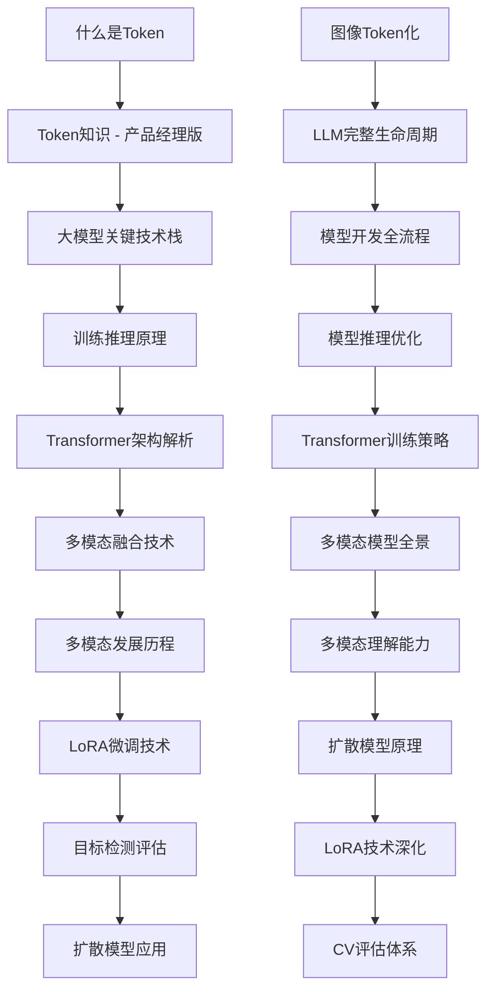

# LLM基础知识与论文解析 MOC

> [!info] **Map of Content - AI产品经理技术栈核心指南**
> 
> 本MOC整理了大语言模型(LLM)领域的基础知识和关键论文，为AI产品经理提供完整的技术栈学习路径。

## 🗺️ 知识体系概览

### 核心学习路径

### 📚 学习层级结构

#### 1️⃣ 基础概念层
- [[01-什么是Token]] - 模型处理文本的基本单元
- [[02-Token知识 - AI产品经理版]] - 业务应用视角
- [[03-图像Token化]] - 视觉数据处理技术
- [[04-LLM完整生命周期]] - 训练、推理、微调三大环节

#### 2️⃣ 技术核心层
- [[05-大模型关键技术栈]] - Transformer、Attention等技术支柱
- [[06-模型开发全流程]] - 从训练到部署的完整流程
- [[07-训练推理原理]] - 深度学习核心原理
- [[08-模型推理优化]] - 性能优化关键技术

#### 3️⃣ 架构深入层
- [[07-Transformer架构解析]] - 核心组件详解
- [[08-Transformer训练策略]] - 训练技巧与优化
- [[09-多模态融合技术]] - 跨模态对齐技术
- [[10-多模态模型全景]] - 多模态模型分类

#### 4️⃣ 应用发展层
- [[11-多模态发展历程]] - 技术演进路线
- [[12-多模态理解能力]] - 核心能力建设
- [[13-LoRA微调技术]] - 高效微调方法
- [[14-扩散模型原理]] - 生成模型基础

#### 5️⃣ 评估应用层
- [[15-目标检测评估]] - CV评估指标
- [[16-LoRA技术深化]] - 实践应用与优化
- [[17-扩散模型应用]] - 实际应用场景
- [[18-CV评估体系]] - 完整评估框架

## 🎯 学习建议

### 产品经理关注重点
1. **技术可行性评估** - 理解技术边界和限制
2. **成本效益分析** - Token计价、训练成本、推理成本
3. **用户体验优化** - 模型性能与用户体验的平衡

### 学习顺序建议
1. **基础概念** → 理解Token、模型生命周期
2. **技术原理** → 深入Transformer、训练推理
3. **架构设计** → 掌握核心技术栈
4. **多模态** → 扩展到多模态理解
5. **微调技术** → 学习LoRA等高效方法
6. **评估应用** → 掌握评估指标和实际应用

## 🔗 相关资源

### 可视化工具
- [[LLM基础知识与论文解析.canvas]] - 知识体系可视化图谱

### 详细学习资料
- [[01-什么是Token]] - Token技术基础
- [[02-Token知识 - AI产品经理版]] - 产品经理视角
- [[03-图像Token化]] - 视觉数据处理
- [[04-LLM完整生命周期]] - 模型全流程管理
- [[05-大模型关键技术栈]] - 技术栈详解
- [[06-模型开发全流程]] - 开发流程管理
- [[07-训练推理原理]] - 深度原理解析
- [[08-模型推理优化]] - 性能优化技术
- [[07-Transformer架构解析]] - 架构深入分析
- [[08-Transformer训练策略]] - 训练优化策略
- [[09-多模态融合技术]] - 多模态技术
- [[11-LoRA微调技术]] - 高效微调方法

### 扩展阅读
- [[AI大模型学习体系/MOC - AI大模型学习路径]] - 完整学习路径
- [[AI产品经理技术栈]] - 产品经理技术能力地图

## 📝 知识状态

- #学习进行中 🟡 - 正在深入学习相关概念
- #基础概念 ✅ - 已掌握基础知识
- #技术原理 🟡 - 正在理解技术原理
- #应用实践 🔴 - 待实践验证

---

*最后更新：2024年*
*相关项目：[[AI产品经理技术栈项目]]*
*学习进度：第1层（基础概念层）完成中*